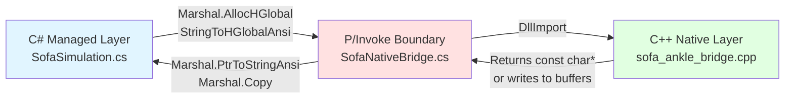
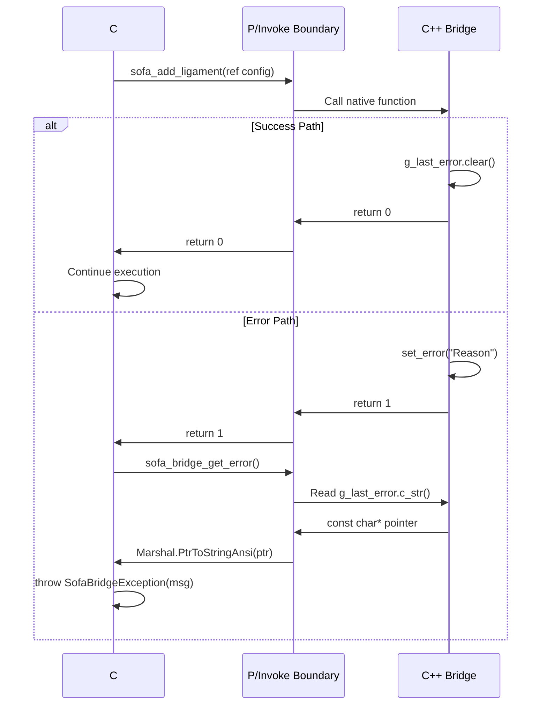

# Native Boundary Guide — C# ↔ C++ Interop

**Purpose:** Complete reference for memory management, struct marshaling, and error handling across the P/Invoke boundary. This document prevents memory leaks, access violations, and data corruption.

**Audience:** C#/Unity developers who need to add structs, functions, or modify the native bridge.

---

## Mental Model — Three-Layer Architecture

Every call from Unity C# to SOFA physics crosses three layers:



**Memory ownership rules by layer:**

| Layer | Allocates | Frees | Owns During Call |
|-------|-----------|-------|------------------|
| **C# Managed** | Input strings (`StringToHGlobalAnsi`), bulk arrays (`AllocHGlobal`) | `FreeHGlobal` in `finally` block | Input parameters |
| **P/Invoke Boundary** | Nothing — marshals data by copy or pointer | Nothing — transparent passthrough | Nothing |
| **C++ Native** | Error strings (global `g_last_error`), scene graph (global `g_root`) | On next call or shutdown | Output strings, persistent state |

**Critical rule:** If C# allocates an IntPtr, C# must free it. If C++ returns a `const char*`, C# must NOT free it.

---

## Memory Ownership Rules — Every Struct That Crosses the Boundary

### Pattern 1: C#-Allocated Strings (Caller Frees)

**Structs:** `SofaLigamentConfig`, `SofaRigidBoneConfig`, `SofaDeformableConfig`, `SofaResectionCommand`

**Contract:** C# allocates IntPtr via `Marshal.StringToHGlobalAnsi()`, passes to C++, C++ reads it, C# frees via `Marshal.FreeHGlobal()`.

**C++ side (sofa_ankle_bridge.h:38,79,162,175):**
```c
typedef struct {
    const char* name;           // borrowed pointer (C# retains ownership)
    // ... other fields
} SofaLigamentConfig;
```

**C# side (NativeStructs.cs:63):**
```csharp
public static SofaLigamentConfig Create(string ligamentName, ...)
{
    return new SofaLigamentConfig
    {
        name = Marshal.StringToHGlobalAnsi(ligamentName), // ALLOCATION
        // ... other fields
    };
}
```

**Cleanup (NativeStructs.cs:81-101):**
```csharp
public static void FreeNamePtrs(SofaLigamentConfig[] configs)
{
    for (int i = 0; i < configs.Length; i++)
    {
        if (configs[i].name != IntPtr.Zero)
        {
            Marshal.FreeHGlobal(configs[i].name);  // MUST FREE
            configs[i].name = IntPtr.Zero;
        }
        // ... free other IntPtr fields
    }
}
```

**What happens if you forget to free:**
- **Symptom:** Gradual memory leak. Each call leaks ~50-200 bytes per string. After 1000 calls, hundreds of KB leaked. Unity Editor becomes sluggish.
- **Detection:** Use a memory profiler (e.g., dotMemory) — unmanaged allocations grow unbounded.
- **Fix:** Wrap every P/Invoke call in `try/finally` (see Pattern section below).

---

### Pattern 2: C#-Allocated Bulk Data (Caller Frees)

**Structs:** `SofaRigidBoneConfig` (collision meshes), `SofaDeformableConfig` (vertices/tetras), `SofaSurfaceMesh` (output buffers)

**Contract:** C# allocates IntPtr for arrays via `Marshal.AllocHGlobal(count * sizeof(T))`, copies managed array data into it, passes to C++, C++ reads it, C# frees.

**C++ side (sofa_ankle_bridge.h:80-83):**
```c
typedef struct {
    const float* collision_vertices;   // borrowed pointer (flattened [x,y,z, ...])
    int collision_vertex_count;        // count of vertices (array size / 3)
    // ...
} SofaRigidBoneConfig;
```

**C# side (NativeStructs.cs:326-330):**
```csharp
if (collisionVertices != null && collisionVertices.Length > 0)
{
    cfg.collisionVertexCount = collisionVertices.Length / 3;
    cfg.collisionVertices = Marshal.AllocHGlobal(collisionVertices.Length * sizeof(float)); // ALLOCATION
    Marshal.Copy(collisionVertices, 0, cfg.collisionVertices, collisionVertices.Length);    // COPY IN
}
```

**Cleanup (NativeStructs.cs:343-360):**
```csharp
public static void FreeNativePtrs(ref SofaRigidBoneConfig cfg)
{
    if (cfg.name != IntPtr.Zero)
    {
        Marshal.FreeHGlobal(cfg.name);
        cfg.name = IntPtr.Zero;
    }
    if (cfg.collisionVertices != IntPtr.Zero)
    {
        Marshal.FreeHGlobal(cfg.collisionVertices);  // MUST FREE
        cfg.collisionVertices = IntPtr.Zero;
    }
    // ... free other arrays
}
```

**What happens if you forget to free:**
- **Symptom:** Large memory leak. A bone with 10,000 vertices leaks 120 KB per call. Ten bones = 1.2 MB leaked.
- **Detection:** Memory profiler shows large unmanaged allocations. Unity Editor heap grows unbounded.
- **Fix:** Call `FreeNativePtrs()` in `finally` block after every P/Invoke.

---

### Pattern 3: C-Owned Strings (Caller Must NOT Free)

**Function:** `sofa_bridge_get_error()` — returns `const char*` pointing to global `g_last_error.c_str()`

**Contract:** C++ owns the string. It lives until the next bridge call or shutdown. C# must copy it immediately to a managed string and never cache the IntPtr.

**C++ side (sofa_ankle_bridge.cpp:215-217):**
```cpp
const char* sofa_bridge_get_error() {
    return g_last_error.c_str();  // Pointer into std::string; invalidated on next set_error() call
}
```

**C# side (SofaNativeBridge.cs:96-100):**
```csharp
[DllImport(LibName, CallingConvention = CallingConvention.Cdecl)]
public static extern IntPtr sofa_bridge_get_error();

public static string GetErrorString()
{
    IntPtr ptr = sofa_bridge_get_error();
    return ptr == IntPtr.Zero ? string.Empty : Marshal.PtrToStringAnsi(ptr);  // COPY IMMEDIATELY
}
```

**WRONG — use-after-free:**
```csharp
IntPtr errPtr = SofaNativeBridge.sofa_bridge_get_error();  // Cache pointer
// ... other code ...
SofaNativeBridge.sofa_step(0.001f);  // This clears g_last_error
string msg = Marshal.PtrToStringAnsi(errPtr);  // CRASH or garbage — pointer now invalid
```

**RIGHT — copy immediately:**
```csharp
string msg = SofaNativeBridge.GetErrorString();  // Copy to managed string before next call
```

**What happens if you cache the IntPtr:**
- **Symptom:** Random crashes, garbage error messages, or stale messages from previous calls.
- **Detection:** Error message doesn't match the actual failure. Debugger shows corrupted string.
- **Fix:** Always call `GetErrorString()` immediately after checking the return code, never cache the IntPtr.

---

### Pattern 4: In/Out Buffers (Caller Allocates, C++ Fills, Caller Copies and Frees)

**Struct:** `SofaSurfaceMesh` — used by `sofa_get_surface_mesh()`

**Contract:** C# allocates buffers with a capacity, passes struct with `vertexCount`/`triangleCount` set to capacity, C++ fills arrays up to capacity and overwrites counts with actual size, C# reads actual counts and copies data.

**C++ side (sofa_ankle_bridge.h:179-184):**
```c
typedef struct {
    float* vertices;      // caller-allocated buffer (flattened [x,y,z, ...])
    int* triangles;       // caller-allocated buffer (flattened [i0,i1,i2, ...])
    int vertex_count;     // IN: capacity, OUT: actual count (may be less than capacity)
    int triangle_count;   // IN: capacity, OUT: actual count (may be less than capacity)
} SofaSurfaceMesh;
```

**C++ implementation (scene_builder.cpp:866-890):**
```cpp
int vert_cap = out->vertex_count;     // Read capacity from C#
int tri_cap = out->triangle_count;

int actual_verts = static_cast<int>(positions.size());  // Actual SOFA data size
int actual_tris = static_cast<int>(triangles.size());

out->vertex_count = std::min(actual_verts, vert_cap);   // Clamp to capacity
out->triangle_count = std::min(actual_tris, tri_cap);

// Fill arrays up to clamped count
for (int i = 0; i < out->vertex_count; i++) {
    out->vertices[i * 3 + 0] = static_cast<float>(positions[i][0]);
    // ...
}
```

**C# allocation (NativeStructs.cs:261-272):**
```csharp
public static SofaSurfaceMesh Create(int maxVertices, int maxTriangles)
{
    var mesh = new SofaSurfaceMesh
    {
        vertexCount = maxVertices,      // Set capacity BEFORE calling C++
        triangleCount = maxTriangles
    };

    mesh.vertices = Marshal.AllocHGlobal(maxVertices * 3 * sizeof(float));   // ALLOCATION
    mesh.triangles = Marshal.AllocHGlobal(maxTriangles * 3 * sizeof(int));

    return mesh;
}
```

**C# usage (SofaSimulation.cs:179-216):**
```csharp
public Mesh GetSurfaceMesh(int maxVertices = 10000, int maxTriangles = 20000)
{
    CheckInitialized();
    var nativeMesh = SofaSurfaceMesh.Create(maxVertices, maxTriangles);  // Allocate with capacity
    try
    {
        int rc = SofaNativeBridge.sofa_get_surface_mesh(ref nativeMesh);
        if (rc != 0)
            throw new SofaBridgeException($"sofa_get_surface_mesh failed: {SofaNativeBridge.GetErrorString()}");

        // Check if data was truncated
        if (nativeMesh.vertexCount == maxVertices || nativeMesh.triangleCount == maxTriangles)
        {
            Debug.LogWarning($"Surface mesh may be truncated: {nativeMesh.vertexCount}/{maxVertices} verts, " +
                             $"{nativeMesh.triangleCount}/{maxTriangles} tris");
            // TODO: Re-allocate with larger capacity and retry
        }

        // Copy native data to managed arrays using ACTUAL counts
        float[] verts = new float[nativeMesh.vertexCount * 3];
        Marshal.Copy(nativeMesh.vertices, verts, 0, verts.Length);  // Copy OUT

        int[] tris = new int[nativeMesh.triangleCount * 3];
        Marshal.Copy(nativeMesh.triangles, tris, 0, tris.Length);

        // Build Unity mesh from copied data
        // ...
    }
    finally
    {
        SofaSurfaceMesh.FreeNativePtrs(ref nativeMesh);  // MUST FREE even if call fails
    }
}
```

**What happens if you allocate too small:**
- **Symptom:** Data is silently truncated. Mesh is incomplete (missing vertices/triangles). No error returned.
- **Detection:** Check if returned `vertexCount` == original capacity — indicates truncation.
- **Fix:** Allocate generously (3x expected size) or implement retry loop: allocate small, call, check if truncated, re-allocate larger and retry.

**What happens if you use capacity instead of actual count:**
- **Symptom:** `Marshal.Copy()` reads uninitialized memory beyond the filled region. Mesh has garbage vertices/triangles. May crash.
- **Detection:** Mesh appears corrupted in Unity. Debugger shows NaN or huge values in vertex data.
- **Fix:** Always use `nativeMesh.vertexCount` (returned value) for `Marshal.Copy()`, not the original capacity.

---

### Pattern 5: Value Types Marshaled by Copy (No Ownership Concern)

**Structs:** `SofaBridgeVersion`, `SofaFrameSnapshot`, `SofaSceneConfig`, `SofaRigidFrame`

**Contract:** These structs contain only value types (int, float, double) or fixed-size arrays. No IntPtr fields. Marshaling copies data in both directions. No allocation, no cleanup.

**C++ side (sofa_ankle_bridge.h:32-35):**
```c
typedef struct {
    double px, py, pz;
    double qx, qy, qz, qw;
} SofaRigidFrame;
```

**C# side (NativeStructs.cs:17-22):**
```csharp
[StructLayout(LayoutKind.Sequential)]
public struct SofaRigidFrame
{
    public double px, py, pz;
    public double qx, qy, qz, qw;
}
```

**Usage (SofaSimulation.cs:131-140):**
```csharp
public SofaFrameSnapshot GetSnapshot()
{
    CheckInitialized();
    var snap = new SofaFrameSnapshot();  // Stack-allocated, no IntPtr
    int rc = SofaNativeBridge.sofa_get_frame_snapshot(ref snap);
    if (rc != 0)
        throw new SofaBridgeException($"sofa_get_frame_snapshot failed: {SofaNativeBridge.GetErrorString()}");
    return snap;  // Return by value — no cleanup needed
}
```

**No cleanup required.** These structs are safe to use without `try/finally`.

---

## The try/finally Pattern — Mandatory for All IntPtr Allocations

**Rule:** Every struct with IntPtr fields MUST be freed in a `finally` block, even if the native call fails.

### Anti-Pattern — Memory Leak

**WRONG:**
```csharp
var cmd = SofaResectionCommand.Create(
    new float[] { 0, 0, 10 },
    new float[] { 0, 0, 1 },
    "TibiaDeformable");

int rc = SofaNativeBridge.sofa_execute_resection(ref cmd);
if (rc != 0)
    throw new SofaBridgeException(SofaNativeBridge.GetErrorString());  // Exception thrown WITHOUT freeing

// If we reach here, boneName IntPtr is leaked
SofaResectionCommand.FreeNativePtrs(ref cmd);  // Never called if exception thrown
```

**Leak size:** `boneName` string allocation (~20 bytes). If called 1000 times in a session, 20 KB leaked.

### Correct Pattern — try/finally Ensures Cleanup

**RIGHT:**
```csharp
var cmd = SofaResectionCommand.Create(
    new float[] { 0, 0, 10 },
    new float[] { 0, 0, 1 },
    "TibiaDeformable");

try
{
    int rc = SofaNativeBridge.sofa_execute_resection(ref cmd);
    if (rc != 0)
        throw new SofaBridgeException(SofaNativeBridge.GetErrorString());
}
finally
{
    SofaResectionCommand.FreeNativePtrs(ref cmd);  // ALWAYS called, even if exception thrown
}
```

### Correct Pattern — Multiple Structs (Reverse Order Cleanup)

**RIGHT:**
```csharp
var tibia = SofaRigidBoneConfig.Create("Tibia", ...);
var talus = SofaRigidBoneConfig.Create("Talus", ...);
SofaLigamentConfig[] ligs = null;

try
{
    SofaNativeBridge.sofa_add_rigid_bone(ref tibia);
    SofaNativeBridge.sofa_add_rigid_bone(ref talus);

    ligs = new[] {
        SofaLigamentConfig.Create("ATFL", ...),
        SofaLigamentConfig.Create("PTFL", ...)
    };

    foreach (var lig in ligs)
    {
        SofaNativeBridge.sofa_add_ligament(ref lig);
    }
}
finally
{
    // Free in reverse order of allocation
    if (ligs != null) SofaLigamentConfig.FreeNamePtrs(ligs);
    SofaRigidBoneConfig.FreeNativePtrs(ref talus);
    SofaRigidBoneConfig.FreeNativePtrs(ref tibia);
}
```

**Why reverse order?** Defensive programming. If cleanup order matters (it doesn't in this codebase currently), reverse order mimics C++ RAII destructor order.

### Managed Wrapper Pattern — High-Level API Hides try/finally

**SofaSimulation.cs encapsulates the pattern (SofaSimulation.cs:153-172):**
```csharp
public int ExecuteResection(Vector3 planePoint, Vector3 planeNormal, string boneName)
{
    CheckInitialized();
    var cmd = SofaResectionCommand.Create(
        new float[] { planePoint.x, planePoint.y, planePoint.z },
        new float[] { planeNormal.x, planeNormal.y, planeNormal.z },
        boneName);
    try
    {
        int rc = SofaNativeBridge.sofa_execute_resection(ref cmd);
        if (rc != 0)
            throw new SofaBridgeException($"sofa_execute_resection failed: {SofaNativeBridge.GetErrorString()}");
        return SofaNativeBridge.sofa_get_removed_element_count();
    }
    finally
    {
        SofaResectionCommand.FreeNativePtrs(ref cmd);  // Encapsulated cleanup
    }
}
```

**Preferred usage for application code:** Use `SofaSimulation.ExecuteResection()` instead of calling P/Invoke directly. The managed wrapper handles memory management.

---

## Adding a New Struct — Step-by-Step Checklist

### Step 1: Define in C Header

**File:** `/home/coreyt/projects/couch/spike/spike2_native/include/sofa_ankle_bridge.h`

```c
typedef struct {
    const char* name;           // String fields must be const char* (not char*)
    float stiffness;            // Use float or double for numeric fields
    int enable_feature;         // Use int for booleans (0 = false, 1 = true)
    float position[3];          // Fixed-size arrays embedded directly
} SofaNewFeatureConfig;
```

**Rules:**
- Use `const char*` for strings (C# will pass via `StringToHGlobalAnsi`)
- Use `int` for booleans (C# `bool` marshals unpredictably)
- Use `int` for enums (avoid C++ `enum` types — they have platform-dependent size)
- Use fixed-size arrays `float arr[N]` for small arrays (marshaled inline)
- Use `const float*` for bulk arrays (C# will pass via `AllocHGlobal`)
- No padding — if alignment matters, add explicit `int _padding` fields

### Step 2: Mirror in C# with StructLayout

**File:** `/home/coreyt/projects/couch/unity-project/Assets/AnkleSim/Bridge/NativeStructs.cs`

```csharp
[StructLayout(LayoutKind.Sequential)]
public struct SofaNewFeatureConfig
{
    public IntPtr name;               // const char* → IntPtr
    public float stiffness;           // float → float
    public int enableFeature;         // int → int (camelCase naming convention)

    [MarshalAs(UnmanagedType.ByValArray, SizeConst = 3)]
    public float[] position;          // float[3] → float[] with MarshalAs
}
```

**Rules:**
- MUST have `[StructLayout(LayoutKind.Sequential)]` — this prevents C# from reordering fields
- Field types must match EXACTLY:
  - `const char*` → `IntPtr`
  - `const float*` → `IntPtr`
  - `float` → `float`
  - `double` → `double`
  - `int` → `int`
  - `float arr[N]` → `[MarshalAs(UnmanagedType.ByValArray, SizeConst = N)] float[]`
- Field ORDER must match C header exactly (C# reads sequentially by offset)
- Use C# naming conventions (camelCase) even if C uses snake_case

### Step 3: Add Create() Factory Method

**In NativeStructs.cs, below the struct definition:**
```csharp
public static SofaNewFeatureConfig Create(string featureName, float stiffness, bool enable, float[] position)
{
    return new SofaNewFeatureConfig
    {
        name = Marshal.StringToHGlobalAnsi(featureName),  // ALLOCATION
        stiffness = stiffness,
        enableFeature = enable ? 1 : 0,
        position = position
    };
}
```

**Rules:**
- Allocate all `const char*` fields via `Marshal.StringToHGlobalAnsi()`
- Allocate all `const float*` / `const int*` fields via `Marshal.AllocHGlobal()` + `Marshal.Copy()`
- Convert C# `bool` to `int` (true → 1, false → 0)

### Step 4: Add FreeNativePtrs() Cleanup Method

**In NativeStructs.cs, below Create():**
```csharp
public static void FreeNativePtrs(ref SofaNewFeatureConfig cfg)
{
    if (cfg.name != IntPtr.Zero)
    {
        Marshal.FreeHGlobal(cfg.name);
        cfg.name = IntPtr.Zero;
    }
}
```

**Rules:**
- Free EVERY IntPtr field allocated in `Create()`
- Check for `IntPtr.Zero` before freeing (defensive — multiple calls to `FreeNativePtrs()` must be safe)
- Set field to `IntPtr.Zero` after freeing (prevents double-free)

### Step 5: Add P/Invoke Declaration

**File:** `/home/coreyt/projects/couch/unity-project/Assets/AnkleSim/Bridge/SofaNativeBridge.cs`

```csharp
[DllImport(LibName, CallingConvention = CallingConvention.Cdecl)]
public static extern int sofa_configure_feature(ref SofaNewFeatureConfig config);
```

**Rules:**
- Use `ref` for struct parameters (passes pointer to struct, not by-value copy)
- Use `CallingConvention.Cdecl` (SOFA uses C calling convention)
- Return type must match C declaration (0/non-zero for success/error by convention)

### Step 6: Add Managed Wrapper in SofaSimulation

**File:** `/home/coreyt/projects/couch/unity-project/Assets/AnkleSim/Bridge/SofaSimulation.cs`

```csharp
public void ConfigureFeature(string name, float stiffness, bool enable, Vector3 position)
{
    CheckInitialized();
    var config = SofaNewFeatureConfig.Create(
        name,
        stiffness,
        enable,
        new float[] { position.x, position.y, position.z });
    try
    {
        int rc = SofaNativeBridge.sofa_configure_feature(ref config);
        if (rc != 0)
            throw new SofaBridgeException(
                $"sofa_configure_feature failed: {SofaNativeBridge.GetErrorString()}");
    }
    finally
    {
        SofaNewFeatureConfig.FreeNativePtrs(ref config);
    }
}
```

**Rules:**
- Always call `CheckInitialized()` first
- Always wrap P/Invoke in `try/finally`
- Always check return code and call `GetErrorString()` if non-zero
- Throw `SofaBridgeException` for errors (application code expects this)

### Step 7: Test Struct Marshaling

**Write a PlayMode test:**
```csharp
[UnityTest]
public IEnumerator ConfigureFeature_Succeeds()
{
    Assert.AreEqual(0, SofaNativeBridge.sofa_bridge_init(PluginDir));

    var config = SofaNewFeatureConfig.Create("TestFeature", 1.5f, true, new float[] { 1, 2, 3 });
    try
    {
        int rc = SofaNativeBridge.sofa_configure_feature(ref config);
        Assert.AreEqual(0, rc, $"Failed: {SofaNativeBridge.GetErrorString()}");
    }
    finally
    {
        SofaNewFeatureConfig.FreeNativePtrs(ref config);
    }

    yield return null;
}
```

**What to verify:**
- P/Invoke succeeds (return code 0)
- C++ receives correct values (add debug logging in C++ implementation to print values)
- No memory leak (run test 100 times, check Unity Profiler for unmanaged allocations)

---

## Adding a New Function — Step-by-Step Checklist

### Step 1: Declare in C Header

**File:** `/home/coreyt/projects/couch/spike/spike2_native/include/sofa_ankle_bridge.h`

```c
/// Brief description of what this function does.
/// @param param_name Description of parameter.
/// @return 0 on success, non-zero on error.
SOFA_BRIDGE_API int sofa_new_function(const SofaConfigStruct* config);
```

**Rules:**
- Return `int` (0 = success, non-zero = error) for all fallible operations
- Return `void` only for infallible operations (rare)
- Use `const` for input parameters
- Document parameters and return value in header comments

### Step 2: Implement in C++

**File:** `/home/coreyt/projects/couch/spike/spike2_native/src/sofa_ankle_bridge.cpp`

```cpp
int sofa_new_function(const SofaConfigStruct* config) {
    if (!g_initialized) {
        set_error("Not initialized — call sofa_bridge_init() first");
        return 1;
    }
    if (!config) {
        set_error("Null config pointer");
        return 1;
    }

    try {
        // Implementation here
        g_last_error.clear();  // Clear error on success
        return 0;
    } catch (const std::exception& e) {
        set_error(std::string("Function failed: ") + e.what());
        return 1;
    } catch (...) {
        set_error("Function failed: unknown error");
        return 1;
    }
}
```

**Rules:**
- Check `g_initialized` first (except for `sofa_bridge_init` and `sofa_bridge_get_version`)
- Validate all pointer parameters for NULL
- Wrap implementation in `try/catch` to prevent C++ exceptions from crossing to C#
- Call `set_error()` before returning non-zero
- Call `g_last_error.clear()` before returning 0 (clears stale errors)

### Step 3: Add P/Invoke Declaration

**File:** `/home/coreyt/projects/couch/unity-project/Assets/AnkleSim/Bridge/SofaNativeBridge.cs`

```csharp
[DllImport(LibName, CallingConvention = CallingConvention.Cdecl)]
public static extern int sofa_new_function(ref SofaConfigStruct config);
```

### Step 4: Add Managed Wrapper

**File:** `/home/coreyt/projects/couch/unity-project/Assets/AnkleSim/Bridge/SofaSimulation.cs`

```csharp
public void NewFunction(/* managed parameters */)
{
    CheckInitialized();
    var config = SofaConfigStruct.Create(/* ... */);
    try
    {
        int rc = SofaNativeBridge.sofa_new_function(ref config);
        if (rc != 0)
            throw new SofaBridgeException(
                $"sofa_new_function failed: {SofaNativeBridge.GetErrorString()}");
    }
    finally
    {
        SofaConfigStruct.FreeNativePtrs(ref config);
    }
}
```

### Step 5: Write Integration Test

**File:** `/home/coreyt/projects/couch/unity-project/Assets/Tests/PlayMode/Bridge/SceneBuilderIntegrationTests.cs`

```csharp
[UnityTest]
public IEnumerator NewFunction_Succeeds()
{
    Assert.AreEqual(0, SofaNativeBridge.sofa_bridge_init(PluginDir));

    var config = SofaConfigStruct.Create(/* test data */);
    try
    {
        int rc = SofaNativeBridge.sofa_new_function(ref config);
        Assert.AreEqual(0, rc, $"Failed: {SofaNativeBridge.GetErrorString()}");

        // Verify side effects (e.g., check scene state)
    }
    finally
    {
        SofaConfigStruct.FreeNativePtrs(ref config);
    }

    yield return null;
}
```

---

## Error Handling Contract

### C++ → C# Error Propagation Flow



### Correct Pattern — Check Return Code First

**RIGHT:**
```csharp
int rc = SofaNativeBridge.sofa_add_ligament(ref ligConfig);
if (rc != 0)
{
    string errorMsg = SofaNativeBridge.GetErrorString();  // Read error IMMEDIATELY after failure
    throw new SofaBridgeException($"sofa_add_ligament failed: {errorMsg}");
}
```

### Anti-Pattern — Reading Error Without Checking Return Code

**WRONG:**
```csharp
SofaNativeBridge.sofa_add_ligament(ref ligConfig);  // Ignore return code
string errorMsg = SofaNativeBridge.GetErrorString();  // May return STALE error from previous call
if (!string.IsNullOrEmpty(errorMsg))
    throw new SofaBridgeException(errorMsg);  // False positive — previous error, not this call's
```

**Why this fails:** `g_last_error` is NOT cleared automatically. If a previous call failed, the error persists until the next successful call clears it. You may throw an exception for a call that actually succeeded.

### Success Clears Errors

**C++ implementation (sofa_ankle_bridge.cpp:175,409):**
```cpp
// Every success path clears the error
g_last_error.clear();
return 0;
```

**Implication:** After a successful call, `GetErrorString()` returns empty string. You cannot retrieve the last error after subsequent successful calls — it's gone.

### Error String Lifetime

**Rule:** The error string returned by `sofa_bridge_get_error()` is valid ONLY until the next bridge call.

**Timeline:**
1. `sofa_add_ligament()` fails → sets `g_last_error = "Ligament not found"`
2. `sofa_bridge_get_error()` returns pointer to `g_last_error.c_str()` → pointer is VALID
3. `Marshal.PtrToStringAnsi(ptr)` copies to managed string → **must happen immediately**
4. `sofa_step()` is called → `g_last_error.clear()` → original pointer now points to empty string or garbage

**WRONG — caching IntPtr:**
```csharp
IntPtr errPtr = SofaNativeBridge.sofa_bridge_get_error();  // Get pointer
// ... other bridge calls ...
string msg = Marshal.PtrToStringAnsi(errPtr);  // CRASH or empty string — pointer invalidated
```

**RIGHT — copy immediately:**
```csharp
string msg = SofaNativeBridge.GetErrorString();  // Helper does Marshal.PtrToStringAnsi immediately
// Now `msg` is a managed string — safe to use after other bridge calls
```

---

## Thread Safety of Global State

### Global Variables in C++ Bridge (sofa_ankle_bridge.cpp:19-26)

```cpp
static bool g_initialized = false;
static sofa::simulation::NodeSPtr g_root;
static std::string g_last_error;
static AnkleSceneState g_scene;
static ThreadManager g_thread_manager;
static SceneBuilder g_builder;
static TripleBuffer<SofaFrameSnapshot> g_snapshot_buffer;
static bool g_use_builder = false;
```

**Critical constraint:** All seven global variables are NOT protected by mutexes (except `g_thread_manager` internals). The bridge is **single-threaded by design**.

### Threading Model

**Rule:** ALL bridge calls must originate from a SINGLE C# thread (Unity's main thread). DO NOT call from:
- Unity Job System workers
- `async/await` continuations (which may resume on different threads)
- Background `Task.Run()` threads
- Coroutines running on separate threads (Unity Coroutines run on main thread by default — safe)

### Async Step Threading (sofa_step_async)

**Contract:** `sofa_step_async()` launches a background thread to run SOFA's `animate()`. Other functions that modify scene state internally call `g_thread_manager.wait()` to prevent data races.

**C++ implementation (sofa_ankle_bridge.cpp:142,435):**
```cpp
int sofa_step(float dt) {
    // Wait for any in-progress async step before running a synchronous one
    g_thread_manager.wait();
    // ... run step on main thread
}

int sofa_execute_resection(const SofaResectionCommand* cmd) {
    // Wait for any in-progress async step to avoid data race
    g_thread_manager.wait();
    // ... modify topology
}
```

**Implication:** You CAN call `sofa_execute_resection()` or `sofa_apply_torque()` while an async step is running, but the call will BLOCK until the step completes. This is automatic — no C# synchronization needed.

### What NOT To Do

**WRONG — calling from Unity Job System:**
```csharp
new Job
{
    OnExecute = () =>
    {
        SofaNativeBridge.sofa_step(0.001f);  // DATA RACE — multiple threads accessing g_root
    }
}.Schedule();
```

**Symptom:** Random crashes, corrupted scene graph, NaN in positions, or access violations.

**RIGHT — use a command queue pattern:**
```csharp
private ConcurrentQueue<Action> _commandQueue = new();

void Update()  // Runs on main thread
{
    while (_commandQueue.TryDequeue(out var cmd))
    {
        cmd();  // Execute all queued commands on main thread
    }
}

void SomeBackgroundThread()
{
    _commandQueue.Enqueue(() =>
    {
        SofaNativeBridge.sofa_step(0.001f);  // Safe — enqueued for main thread execution
    });
}
```

---

## Struct Field Alignment Rules

### StructLayout Is Mandatory

**Without `[StructLayout(LayoutKind.Sequential)]`, C# may reorder fields for packing efficiency.** This causes silent data corruption — fields read wrong values.

**WRONG — missing attribute:**
```csharp
public struct SofaRigidFrame  // No [StructLayout]
{
    public double px, py, pz;
    public double qx, qy, qz, qw;
}
```

**C# compiler may reorder to:**
```csharp
// Hypothetical reordering (C# decides)
{
    double px;
    double qx;  // Moved to align 8-byte boundary
    double py;
    double qy;
    // ...
}
```

**C++ reads:**
```cpp
SofaRigidFrame frame;
// px reads correctly
// py reads qx's value (corruption)
// pz reads qy's value (corruption)
```

**Symptom:** Position/orientation values are swapped or corrupted. No error — just wrong data.

**RIGHT — explicit sequential layout:**
```csharp
[StructLayout(LayoutKind.Sequential)]
public struct SofaRigidFrame
{
    public double px, py, pz;
    public double qx, qy, qz, qw;
}
```

**Guarantee:** C# preserves field order exactly as written. Marshaling matches C struct layout.

### Fixed-Size Array Marshaling

**C declaration:**
```c
typedef struct {
    double tibia_offset[3];
} SofaLigamentConfig;
```

**WRONG — missing MarshalAs:**
```csharp
[StructLayout(LayoutKind.Sequential)]
public struct SofaLigamentConfig
{
    public double[] tibiaOffset;  // This marshals as a POINTER, not inline array
}
```

**What C++ receives:** Pointer to managed heap (garbage address). Accessing it crashes.

**RIGHT — inline array with MarshalAs:**
```csharp
[StructLayout(LayoutKind.Sequential)]
public struct SofaLigamentConfig
{
    [MarshalAs(UnmanagedType.ByValArray, SizeConst = 3)]
    public double[] tibiaOffset;  // Marshaled as 3 doubles inline (24 bytes)
}
```

**Guarantee:** Array data is embedded directly in struct, matching C layout.

---

## Shutdown and Async Step Cancellation

### The 5-Second Timeout Problem

**C++ shutdown implementation (thread_manager.cpp:41-64):**
```cpp
bool ThreadManager::shutdown(int timeout_ms) {
    _cancel_requested.store(true);

    if (!_worker.joinable()) {
        return true;  // No worker running
    }

    // Poll for completion with timeout
    auto deadline = std::chrono::steady_clock::now() +
                    std::chrono::milliseconds(timeout_ms);

    while (!_step_complete.load()) {
        if (std::chrono::steady_clock::now() >= deadline) {
            // Timeout — worker is still running. We MUST join anyway to avoid corruption.
            _worker.join();  // BLOCKS until step completes
            return false;    // Indicate timeout
        }
        std::this_thread::yield();
    }

    join_worker();
    return true;
}
```

**Called from (sofa_ankle_bridge.cpp:186-212):**
```cpp
void sofa_bridge_shutdown() {
    if (!g_initialized) {
        return;
    }

    // Join any in-progress async step before cleanup (5-second timeout)
    g_thread_manager.shutdown(5000);

    // Cleanup scene graph
    // ...
}
```

**Implication:** If `sofa_step_async()` is running when you call `Dispose()` (which calls `sofa_bridge_shutdown()`), Unity Editor FREEZES for up to 5 seconds waiting for the step to finish.

### Correct Pattern — Wait Before Shutdown

**WRONG — shutdown without waiting:**
```csharp
void OnDisable()
{
    _sim?.Dispose();  // Immediate shutdown — may block 5 seconds if step running
}
```

**RIGHT — explicit wait before shutdown:**
```csharp
void OnDisable()
{
    if (_sim != null)
    {
        _sim.WaitForStep();  // Block until current step completes (non-blocking if no step running)
        _sim.Dispose();      // Clean shutdown — no blocking
    }
}
```

**Implementation (SofaBridgeComponent.cs:65-73):**
```csharp
private void OnDisable()
{
    if (_sim != null)
    {
        try
        {
            _sim.WaitForStep();  // Ensure step completes before dispose
            _sim.Dispose();
        }
        catch (Exception e)
        {
            Debug.LogError($"SofaBridge shutdown error: {e}");
        }
    }
}
```

### Why Not Detach the Thread?

**Question:** Why does `shutdown()` join the thread instead of detaching if timeout expires?

**Answer:** Detaching would leave the background thread running and accessing `g_root` after it's destroyed. SOFA's scene graph is NOT thread-safe for concurrent access. Detaching would cause:
- Heap corruption (writing to freed memory)
- Access violations (reading freed pointers)
- Silent state corruption (if shutdown delays destruction)

**Better to block 5 seconds than to corrupt memory.** If 5-second timeout is hit frequently, reduce timestep or step count.

---

## Common Mistakes — Symptoms and Fixes

| Mistake | Symptom | Detection | Fix |
|---------|---------|-----------|-----|
| **Forgot `FreeNativePtrs()` in finally** | Gradual memory leak (100s of KB over session). Unity Editor becomes sluggish. | Memory profiler shows unmanaged allocations growing. | Wrap every P/Invoke call with IntPtr parameters in `try/finally`. Call `FreeNativePtrs()` in `finally`. |
| **Freeing a `const char*` from `sofa_bridge_get_error()`** | Crash or access violation when calling `FreeHGlobal()`. | Exception: "Attempted to read or write protected memory." | Never free error string — it's C++-owned. Use `GetErrorString()` helper which copies immediately. |
| **Wrong struct field order** | Silent data corruption. Fields read wrong values (e.g., position[1] reads position[2]). | Values in C++ don't match values set in C#. Debugger shows swapped fields. | Verify C# struct field order EXACTLY matches C header. Count fields to ensure no accidental swaps. |
| **Missing `[MarshalAs(UnmanagedType.ByValArray)]` on fixed array** | `MarshalDirectiveException` or access violation. | Exception: "Cannot marshal field 'tibiaOffset': Invalid managed/unmanaged type combination." | Add `[MarshalAs(UnmanagedType.ByValArray, SizeConst = N)]` to array field. |
| **Calling P/Invoke after `sofa_bridge_shutdown()`** | Crash or silent wrong behavior (reading freed memory). | Access violation in C++ code. `g_initialized == false` but code doesn't check it. | Check `_initialized` flag in C# wrapper before allowing calls. Throw `ObjectDisposedException` if disposed. |
| **Using capacity instead of actual count in `SofaSurfaceMesh`** | Mesh has garbage vertices/triangles beyond filled region. May crash `Marshal.Copy()`. | Mesh looks corrupted in Unity. Inspector shows NaN or huge values. | Always use returned `nativeMesh.vertexCount` for `Marshal.Copy()`, NOT the original capacity. |
| **Caching IntPtr from `sofa_bridge_get_error()`** | Crash, garbage error messages, or stale errors. | Error message doesn't match failure. Debugger shows corrupted string. | Call `GetErrorString()` immediately after checking return code. Never cache the IntPtr. |
| **Calling from multiple C# threads** | Random crashes, corrupted scene graph, NaN in positions. | Non-deterministic failures. Stack trace shows different threads. | Serialize all bridge calls to Unity's main thread. Use command queue pattern for background threads. |
| **Missing `[StructLayout(LayoutKind.Sequential)]`** | Silent data corruption (C# reorders fields). | Fields read wrong values but no exception. | Add `[StructLayout(LayoutKind.Sequential)]` to EVERY struct that crosses the boundary. |
| **Allocating too small buffer for `SofaSurfaceMesh`** | Data silently truncated. Mesh is incomplete. No error returned. | Returned `vertexCount` == original capacity (indicates truncation). | Allocate 3x expected size, or check for truncation and retry with larger capacity. |
| **Forgetting `sofa_scene_finalize()` before stepping** | `sofa_step()` succeeds but scene is empty. Zero forces, no motion. | ROM is always 0. Ligament forces are zero. | Check `sofa_scene_is_ready()` before stepping. Call `sofa_scene_finalize()` after adding all components. |

---

## Version Handshake — Preventing API Mismatches

### How It Works

**C++ returns version (sofa_ankle_bridge.cpp:38-46):**
```cpp
SofaBridgeVersion sofa_bridge_get_version() {
    SofaBridgeVersion v = {};
    v.bridge_version_major = 0;
    v.bridge_version_minor = 2;
    v.bridge_version_patch = 0;
    v.sofa_version_major = 24;
    v.sofa_version_minor = 6;
    return v;
}
```

**C# checks version (SofaSimulation.cs:19-28):**
```csharp
Version = SofaNativeBridge.sofa_bridge_get_version();

// Version handshake: major version must match expected
const int expectedMajor = 0;
if (Version.bridgeVersionMajor != expectedMajor)
{
    throw new SofaBridgeException(
        $"Bridge version mismatch: expected major={expectedMajor}, " +
        $"got major={Version.bridgeVersionMajor}");
}
```

### What's Checked

- **Major version** — MUST match. Breaking changes (struct layout, function signature, calling convention).
- **Minor version** — NOT checked. Backward-compatible additions (new functions, new fields at end of struct).
- **Patch version** — NOT checked. Bug fixes only.

### When Version Check Fails

**Scenario:** C# code expects bridge 1.0.0, but DLL is 0.2.0.

**What happens:**
```
SofaBridgeException: Bridge version mismatch: expected major=1, got major=0
```

**Fix:** Rebuild native DLL from matching commit and re-deploy to `Assets/Plugins/x86_64/`.

### When Missing Function Is Called

**Scenario:** C# references `sofa_new_function()` added in 0.3.0, but DLL is 0.2.0.

**What happens:**
```
EntryPointNotFoundException: Unable to find an entry point named 'sofa_new_function' in DLL 'SofaAnkleBridge'.
```

**Symptom:** Exception thrown at runtime (NOT compile time). Unity doesn't check DLL exports at build.

**Fix:** Rebuild DLL with the new function or revert C# code to match deployed DLL version.

### Development Workflow

1. **Make changes to C++** — add function, change struct
2. **Update version in C header** — bump major (breaking) or minor (additive)
3. **Rebuild DLL** — `cmake --build build`
4. **Deploy DLL** — copy all DLLs to `Assets/Plugins/x86_64/`
5. **Update C# code** — mirror struct changes, add P/Invoke declarations
6. **Update version check** — if major version changed, update `expectedMajor` in `SofaSimulation.cs`
7. **Run tests** — PlayMode tests verify DLL loads and functions work

**Always deploy matching DLL and C# code together.** Never mix versions.

---

## Summary — Memory Safety Checklist

Before submitting a PR that touches the native boundary, verify:

- [ ] Every struct with IntPtr fields has a `Create()` factory and `FreeNativePtrs()` cleanup method
- [ ] Every P/Invoke call with IntPtr parameters is wrapped in `try/finally`
- [ ] `FreeNativePtrs()` is called in the `finally` block, even if the native call fails
- [ ] Error string is read immediately via `GetErrorString()` after checking return code
- [ ] No code caches the IntPtr from `sofa_bridge_get_error()`
- [ ] All structs crossing the boundary have `[StructLayout(LayoutKind.Sequential)]`
- [ ] Fixed-size arrays use `[MarshalAs(UnmanagedType.ByValArray, SizeConst = N)]`
- [ ] Field order in C# struct EXACTLY matches C header
- [ ] New functions increment bridge version (major for breaking, minor for additive)
- [ ] PlayMode integration test verifies the new struct/function works end-to-end
- [ ] All bridge calls originate from Unity's main thread (no Job System, no `async/await` threading)
- [ ] `SofaSimulation.WaitForStep()` is called in `OnDisable()` before `Dispose()`

**If all 12 items pass, the code is memory-safe.**

---

## Related Documentation

- **[SOFA Integration Patterns](/home/coreyt/projects/couch/docs/dev/sofa-patterns.md)** — how SOFA scene construction works, ligament mechanics, solver stability
- **[C API Reference](/home/coreyt/projects/couch/docs/dev/api-reference-c.md)** — complete function-by-function reference with preconditions and thread safety
- **[Testing Guide](/home/coreyt/projects/couch/docs/dev/testing.md)** — how to write PlayMode tests that verify native boundary behavior
- **[Developer Onboarding Guide](/home/coreyt/projects/couch/docs/dev/onboarding.md)** — building and deploying the native DLL

**ADRs:**
- **[ADR-0001: Centroid-Based Resection](/home/coreyt/projects/couch/docs/adr/0001-centroid-based-resection.md)** — why resection uses tetrahedral removal
- **[ADR-0003: Undo via Scene Rebuild](/home/coreyt/projects/couch/docs/adr/0003-undo-via-scene-rebuild.md)** — why resection undo destroys the scene

---

**Document version:** 1.0 (2026-02-15)
**Codebase version:** main branch, post-Sprint 4 (Windows DLL deployment complete)
