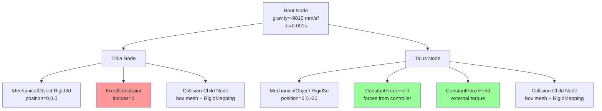
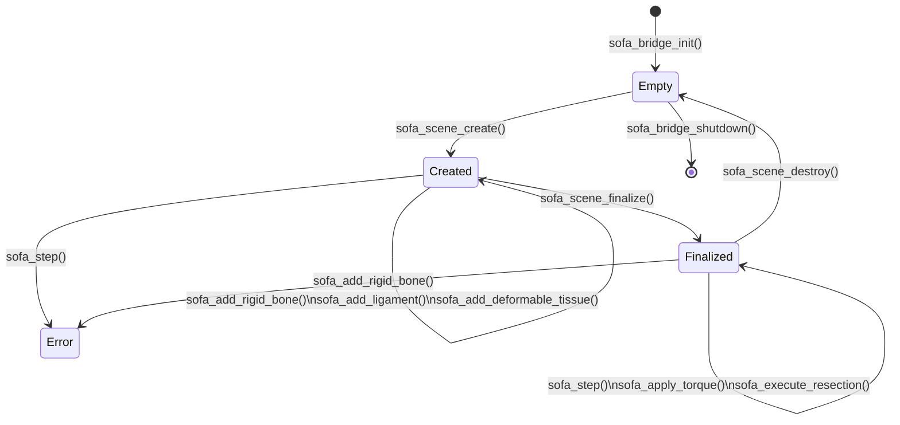

# SOFA Integration Patterns

**Purpose:** The survival guide for working with SOFA Framework through the native bridge. Every hard-won lesson in one place.

**Audience:** Unity/C# developers who need to modify the SOFA simulation but have never used SOFA or FEM physics before.

---

## Table of Contents

1. [SOFA in 5 Minutes](#sofa-in-5-minutes)
2. [The Emergent Joint Model](#the-emergent-joint-model)
3. [Ligament Force Model](#ligament-force-model)
4. [Scene Construction Lifecycle](#scene-construction-lifecycle)
5. [Solver Parameters and Stability](#solver-parameters-and-stability)
6. [Resection (Bone Cutting)](#resection-bone-cutting)
7. [Coordinate System and Units](#coordinate-system-and-units)
8. [Debugging SOFA Problems](#debugging-sofa-problems)

---

## SOFA in 5 Minutes

SOFA Framework is a physics simulation engine designed for deformable objects and medical simulation. You don't need to understand FEM theory to work with this project — just these core concepts.

### Scene Graph

SOFA organizes components into a tree of **nodes**. Each node can contain:
- **Simulation components** (solvers, force fields, collision models)
- **Child nodes** (inherit coordinate frames)

The COUCH ankle scene has this structure:
```
root (gravity, timestep, collision pipeline)
├── Tibia (fixed bone node)
│   ├── MechanicalObject (position/velocity state)
│   ├── UniformMass
│   ├── FixedConstraint (prevents movement)
│   └── Collision (child node with collision mesh)
└── Talus (free bone node)
    ├── MechanicalObject (position/velocity state)
    ├── UniformMass
    ├── ConstantForceField (ligament forces)
    ├── ConstantForceField (external torque)
    └── Collision (child node with collision mesh)
```

### Key Components

**MechanicalObject**: Stores the state (positions, velocities) of a physical object. Template parameter specifies the coordinate type:
- `Rigid3d` — 3D rigid body (position + quaternion orientation)
- `Vec3d` — 3D point cloud (for deformable meshes)

**ForceField**: Applies forces to a MechanicalObject. Types used in COUCH:
- `ConstantForceField` — applies user-specified forces/torques (used for ligaments and external torques)
- `TetrahedronFEMForceField` — computes elastic forces for deformable tissue based on Young's modulus (material stiffness, in Pa) and Poisson's ratio (ratio of transverse to axial strain)

**Solver**: Computes new positions/velocities each timestep:
- `EulerImplicitSolver` — implicit time integration (stable for stiff systems)
- `CGLinearSolver` — conjugate gradient solver for the linear system

**Collision Pipeline**: Detects and resolves collisions between objects:
- `BruteForceBroadPhase` — finds all potentially colliding pairs
- `BVHNarrowPhase` — precise collision detection using bounding volume hierarchies
- `LocalMinDistance` — computes proximity distance
- `FrictionContactConstraint` — resolves contacts with friction

**Mapping**: Projects positions from one coordinate space to another:
- `RigidMapping` — maps deformable collision mesh positions from rigid body frame to world frame
- `Tetra2TriangleTopologicalMapping` — extracts surface triangles from tetrahedral mesh for visualization

### Animation Loop

Each simulation step follows this sequence:
1. **Apply forces** — ligament controller computes spring-damper forces and writes to ConstantForceField
2. **Animate** — SOFA calls `sofa::simulation::node::animate(root, dt)`:
   - Solvers compute new velocities and positions
   - Collision detection finds contacts
   - Constraint solver resolves contacts and joint constraints
3. **Read results** — positions, angles, and forces are read back into `SofaFrameSnapshot`

---

## The Emergent Joint Model

The ankle joint in COUCH is **not a kinematic joint**. There is no hinge, no axis definition, no angle limits. Instead, joint behavior emerges from the interaction of:

1. **Tibia** — fixed rigid body (immovable)
2. **Talus** — free rigid body (responds to forces)
3. **Ligament springs** — anterior and posterior springs resist rotation in both directions
4. **Bone-bone collision** — prevents penetration

Range of motion (ROM) naturally emerges from these constraints. When you apply a torque to rotate the talus into dorsiflexion (toes-up rotation), the posterior ligaments extend and resist. The equilibrium angle depends on:
- Ligament stiffness
- Ligament rest length
- Applied torque magnitude
- Collision geometry (bone shapes)

### SOFA Scene Graph for Emergent Joint



**Why this works:**
- Tibia is fixed at origin (FixedConstraint prevents all DOF)
- Talus is initially 30mm below tibia along Z axis (initial gap prevents collision at rest)
- Ligament controller computes forces based on current tibia/talus positions and writes to `TalusLigFF`
- External torque (from ROM engine) is written to `TalusTorqueFF`
- EulerImplicit solver integrates forces → velocities → new positions
- Collision pipeline prevents talus from passing through tibia

**Joint angles** are derived from the relative orientation quaternion between tibia and talus. See `scene_builder.cpp:595-635` for the Euler angle decomposition (XYZ intrinsic = sagittal, frontal, transverse).

---

## Ligament Force Model

Ligaments in COUCH use a **custom spring-damper controller** with bilinear stiffness and tension-only behavior. This is implemented in `scene_builder.cpp:372-497`.

### Why Not StiffSpringForceField?

SOFA has a built-in `StiffSpringForceField` component for spring connections. **Do not use it**. It fails when springs connect across a `RigidMapping` (between a rigid body and a deformable child node). The built-in component computes forces correctly but applies them to the wrong DOFs.

From `CLAUDE.md:63`:
> StiffSpringForceField fails across RigidMapping — use a Python/C++ controller + ConstantForceField instead

### Force Computation

For each ligament, the controller computes forces in `applyLigamentForces()` (called before every `animate()` step):

1. **Get attachment points** in world coordinates:
   - Proximal (tibia side): `tibia_pos + tibia_quat.rotate(offset)`
   - Distal (talus side): `talus_pos + talus_quat.rotate(offset)`

2. **Compute spring extension**:
   ```cpp
   Vec3 diff = proximal - distal;
   double length = diff.norm();
   double extension = length - rest_length;
   ```

3. **Tension-only check** — ligaments resist tension, not compression:
   ```cpp
   if (extension <= 0.0) continue;  // no force in compression
   ```

4. **Bilinear spring force** (optional, defaults to linear):
   - **Toe region** (0 to `toe_region_strain`): uses `toe_stiffness` (lower)
   - **Linear region** (beyond `toe_region_strain`): uses `stiffness` (higher)
   - Transition is continuous at the boundary
   ```cpp
   double strain = extension / rest_length;
   if (strain < toe_region_strain) {
       force_mag = toe_stiffness * extension;
   } else {
       double toe_ext = toe_region_strain * rest_length;
       force_mag = toe_stiffness * toe_ext + stiffness * (extension - toe_ext);
   }
   ```
   - If `toe_region_strain == 0`, uses pure linear model: `force_mag = stiffness * extension`

5. **Damping force** along spring axis (velocity-based):
   ```cpp
   double vel_along = talus_vel * direction;  // dot product
   Vec3 damping_force = direction * (-damping * vel_along);
   ```

6. **Final clamping** — ensure net force is tension-only:
   ```cpp
   Vec3 force = spring_force + damping_force;
   double net_along = force * direction;
   if (net_along < 0.0) force = Vec3(0, 0, 0);
   ```

7. **Torque** from attachment offset:
   ```cpp
   Vec3 r = distal - talus_pos;  // lever arm
   Vec3 torque = r.cross(force);
   ```

8. **Write to ConstantForceField** as a 6-component wrench `[fx fy fz tx ty tz]`

### Default Ligament Values

From `ankle_scene.cpp:23-40`:
```cpp
{"ATFL",       {15.0, 10.0, -14.0}, {12.0, 8.0, 11.0},  70.0, 5.0, 0.0}
{"PTFL",       {15.0,-10.0, -14.0}, {12.0,-8.0, 11.0},  50.0, 5.0, 0.0}
{"Deltoid_ant",{-12.0, 10.0,-14.0}, {-10.0, 8.0,11.0},  90.0, 5.0, 0.0}
{"Deltoid_post",{-12.0,-10.0,-14.0},{-10.0,-8.0,11.0},  90.0, 5.0, 0.0}
```
- **Stiffness**: 50-90 N/mm
- **Damping**: 5.0 N·s/mm
- **Rest length**: 0 (auto-computed from initial geometry)

### Stability Envelope

**Critical:** Stiffness values must stay within ~3x of defaults to avoid solver divergence.

From `CLAUDE.md:67`:
> high stiffness (>3x) causes divergence; use damping (~5 N*s/mm)

Safe ranges:
- **Stiffness**: 20-250 N/mm (tested range)
- **Damping**: 3-10 N·s/mm (5 is stable baseline)
- **Timestep**: 0.001s (1ms) — do not reduce below 0.0005s

**What happens outside these ranges:**
- Stiffness > 270 N/mm → solver diverges within 10 steps → all positions become NaN → `snapshot.solverDiverged = 1`
- Damping < 2 N·s/mm → oscillations, slow convergence
- Damping > 15 N·s/mm → over-damped, feels "mushy"
- Timestep > 0.002s → collision tunneling (talus passes through tibia)

### One-Step Lag in Force Application

Forces computed at step N apply at step N+1. This is a SOFA behavior when using `ConstantForceField`.

From `CLAUDE.md:67`:
> One-step lag with ConstantForceField — forces computed at step N apply at step N+1

**Why this happens:**
1. `applyLigamentForces()` reads positions at step N, computes forces, writes to ConstantForceField
2. `animate()` reads the ConstantForceField and integrates forces → velocities → positions for step N+1
3. EulerImplicit solver overwrites velocities, so direct velocity modification doesn't work

**What this means for you:**
- Ligament forces are always one step behind current positions — this is stable as long as forces change slowly
- Do NOT apply impulsive forces (sudden large torques) — they will overshoot
- Do NOT use stiffness > 3x default — the lag amplifies overshoot

### Anterior + Posterior Pair Requirement

Ligaments are tension-only. A single ligament can only resist rotation in one direction. To constrain sagittal plane ROM (dorsiflexion and plantarflexion, or upward/downward foot rotation), you need **both anterior and posterior ligaments**.

From `CLAUDE.md:65`:
> Ligaments must resist both directions — need anterior AND posterior attachments for sagittal plane ROM

**Wrong — one ligament:**
```cpp
// Only ATFL (anterior) — resists dorsiflexion but NOT plantarflexion
{"ATFL", {15.0, 10.0, -14.0}, {12.0, 8.0, 11.0}, 70.0, 5.0, 0.0}
```
Result: Talus freely rotates into plantarflexion under gravity (no resistance).

**Right — anterior + posterior pair:**
```cpp
{"ATFL", {15.0, 10.0, -14.0}, {12.0, 8.0, 11.0}, 70.0, 5.0, 0.0}  // resists dorsiflexion
{"PTFL", {15.0,-10.0, -14.0}, {12.0,-8.0, 11.0}, 50.0, 5.0, 0.0}  // resists plantarflexion
```
Result: Talus equilibrium angle is balanced by both springs.

---

## Scene Construction Lifecycle

SOFA scenes must be constructed in a strict sequence. The `SceneBuilder` class enforces this via a state machine (see `scene_builder.h:63-67`).

### State Machine



### State Descriptions

**Empty** — Bridge initialized, no scene exists.
- **Valid calls**: `sofa_scene_create()`, `sofa_scene_create_ankle()`, `sofa_bridge_shutdown()`
- **Invalid calls**: `sofa_add_rigid_bone()`, `sofa_step()` (return error)

**Created** — Scene root exists, components are being added.
- **Valid calls**: `sofa_add_rigid_bone()`, `sofa_add_ligament()`, `sofa_add_deformable_tissue()`, `sofa_scene_finalize()`
- **Invalid calls**: `sofa_step()` (no error, but scene is empty — produces zero forces)
- **Invalid calls**: `sofa_scene_create()` again (return error "Scene already active")

**Finalized** — Scene is initialized, ready for simulation.
- **Valid calls**: `sofa_step()`, `sofa_step_async()`, `sofa_apply_torque()`, `sofa_execute_resection()`, `sofa_get_frame_snapshot()`, `sofa_scene_destroy()`
- **Invalid calls**: `sofa_add_rigid_bone()` (return error "Scene already finalized")

### What Happens in Each State

**`sofa_scene_create(config)`** (Empty → Created):
- Creates root node with gravity, timestep from `SofaSceneConfig`
- Adds SOFA plugins: collision pipeline, animation loop, constraint solver
- Sets collision detection parameters: `alarm_distance`, `contact_distance`
- Stores scene in `SceneBuilder::_root`

**`sofa_add_rigid_bone(config)`** (Created only):
- Creates child node under root
- Adds `MechanicalObject<Rigid3d>` with initial position/orientation
- Adds `UniformMass`, `EulerImplicitSolver`, `CGLinearSolver`
- If `is_fixed == 1`, adds `FixedConstraint`
- If collision mesh provided, creates Collision child node with `RigidMapping`
- Stores bone in `SceneBuilder::_bones` vector

**`sofa_add_ligament(config)`** (Created only):
- Validates that `bone_a_name` and `bone_b_name` exist in `_bones`
- Stores ligament parameters in `SceneBuilder::_ligaments` vector
- No SOFA components created yet — ligaments are applied via controller in Finalized state

**`sofa_scene_finalize()`** (Created → Finalized):
- Calls `sofa::simulation::node::initRoot(_root.get())` — SOFA initializes all components, allocates memory, resolves topology
- Resolves typed pointers for all bones (e.g., `dynamic_cast<MechanicalState<Rigid3Types>*>(node->getObject("TibiaMO"))`)
- Auto-computes rest lengths for ligaments with `rest_length == 0`
- Sets `_state = Finalized`

**`sofa_step(dt)`** (Finalized only):
- Calls `applyLigamentForces()` — computes spring-damper forces, writes to ConstantForceField
- Calls `sofa::simulation::node::animate(_root.get(), dt)` — SOFA solver integrates forces, resolves collisions
- Increments step counter
- Fills triple buffer with new snapshot

### Common Violations and Their Consequences

**Forgetting `sofa_scene_finalize()`:**
```cpp
sofa_scene_create(&config);
sofa_add_rigid_bone(&tibia);
sofa_add_rigid_bone(&talus);
// Missing: sofa_scene_finalize()
sofa_step(0.001f);  // No error, but scene is empty — produces zero ROM
```
**Symptom**: `sofa_step()` succeeds, but `snapshot.joint_angles_deg` is always `[0, 0, 0]`. Bones don't move.

**Diagnosis**: Check `sofa_scene_is_ready()` — returns 0.

**Fix**: Call `sofa_scene_finalize()` after adding all components, before first `sofa_step()`.

---

**Adding components after finalize:**
```cpp
sofa_scene_finalize();
sofa_add_ligament(&new_lig);  // Error: "Scene already finalized"
```
**Symptom**: Function returns non-zero, `sofa_bridge_get_error()` returns error message.

**Fix**: Destroy scene, recreate from scratch (see [Resection > Undo via Scene Rebuild](#undo-via-scene-rebuild)).

---

**Calling step on empty scene:**
```cpp
sofa_scene_create(&config);
sofa_step(0.001f);  // No error, but _root has no child nodes
```
**Symptom**: No crash, but snapshot contains garbage (uninitialized positions).

**Fix**: Add bones before stepping.

---

## Solver Parameters and Stability

The `SofaSceneConfig` struct (see `sofa_ankle_bridge.h:66-76`) controls physics accuracy and stability.

```c
typedef struct {
    float gravity[3];              // mm/s² (e.g., [0, 0, -9810])
    float timestep;                // seconds (e.g., 0.001 for 1ms)
    int   constraint_iterations;   // GenericConstraintSolver iterations
    float constraint_tolerance;    // convergence threshold
    float rayleigh_stiffness;      // damping proportional to stiffness
    float rayleigh_mass;           // damping proportional to mass
    float alarm_distance;          // collision proximity detection (mm)
    float contact_distance;        // collision resolution threshold (mm)
    float friction_coefficient;    // surface friction (unused in current impl)
} SofaSceneConfig;
```

### Parameter Guide

| Parameter | Purpose | Safe Range | Default | What Happens Outside Range |
|-----------|---------|------------|---------|---------------------------|
| **gravity[2]** | Z-axis gravity (mm/s²) | -20000 to 0 | -9810 | Too high: bones accelerate unrealistically. Zero: no gravity (fine for ROM testing). |
| **timestep** | Simulation step duration (s) | 0.0005 to 0.002 | 0.001 | Too small: slow simulation. Too large: collision tunneling (bones pass through each other). |
| **constraint_iterations** | Max iterations for constraint solver | 100 to 500 | 200 | Too low: contacts don't converge (bones penetrate). Too high: slow simulation. |
| **constraint_tolerance** | Constraint convergence threshold | 1e-6 to 1e-3 | 1e-4 | Too tight: solver can't converge. Too loose: inaccurate contact forces. |
| **rayleigh_stiffness** | Stiffness-proportional damping | 0 to 1.0 | 0.1 | Higher: more damping on stiff ligaments (reduces oscillations). Too high: over-damped. |
| **rayleigh_mass** | Mass-proportional damping | 0 to 5.0 | 1.0 | Higher: more damping overall. Too high: bones move sluggishly. |
| **alarm_distance** | Collision proximity trigger (mm) | 5 to 15 | 8 | Too small: late collision detection. Too large: false collisions at distance. |
| **contact_distance** | Collision resolution threshold (mm) | 1 to 5 | 3 | Too small: penetration allowed. Too large: bones repel prematurely. |

### Recommended Configurations

**Fast preview (low accuracy):**
```c
SofaSceneConfig config = {
    .gravity = {0, 0, -9810},
    .timestep = 0.002f,           // 2ms steps (500 Hz)
    .constraint_iterations = 100, // faster convergence check
    .constraint_tolerance = 1e-3f,
    .rayleigh_stiffness = 0.1f,
    .rayleigh_mass = 1.0f,
    .alarm_distance = 10.0f,
    .contact_distance = 5.0f,
};
```
Use for: Interactive ROM exploration, real-time preview.

**Production (clinical accuracy):**
```c
SofaSceneConfig config = {
    .gravity = {0, 0, -9810},
    .timestep = 0.001f,           // 1ms steps (1 kHz)
    .constraint_iterations = 200,
    .constraint_tolerance = 1e-4f,
    .rayleigh_stiffness = 0.1f,
    .rayleigh_mass = 1.0f,
    .alarm_distance = 8.0f,
    .contact_distance = 3.0f,
};
```
Use for: Final ROM measurements, resection planning, validation.

**Debugging (maximum stability):**
```c
SofaSceneConfig config = {
    .gravity = {0, 0, -9810},
    .timestep = 0.0005f,          // 0.5ms steps (2 kHz) — very stable
    .constraint_iterations = 500, // guaranteed convergence
    .constraint_tolerance = 1e-5f,
    .rayleigh_stiffness = 0.2f,   // extra damping
    .rayleigh_mass = 2.0f,
    .alarm_distance = 8.0f,
    .contact_distance = 3.0f,
};
```
Use for: Diagnosing solver divergence, testing extreme ligament stiffness.

### Tuning Workflow

1. **Start with production defaults** (above).
2. **If solver diverges** (NaN in positions):
   - Reduce timestep to 0.0005s
   - Increase rayleigh_stiffness to 0.2
   - Reduce ligament stiffness by 20%
3. **If bones penetrate**:
   - Increase constraint_iterations to 300
   - Reduce contact_distance to 2.0
   - Check that collision meshes are present
4. **If simulation is too slow**:
   - Increase timestep to 0.002s (check for tunneling)
   - Reduce constraint_iterations to 150
   - Use async stepping (`sofa_step_async`)

---

## Resection (Bone Cutting)

Bone resection removes part of a deformable bone mesh along a cut plane. COUCH uses **centroid-based tetrahedral removal** for SOFA physics and **EzySlice** for visual mesh cutting (dual-representation).

### Centroid-Based Removal Algorithm

From ADR-0001 (`docs/adr/0001-centroid-based-resection.md`):

**Decision**: For each tetrahedron, compute the centroid (average of 4 vertex positions). Remove the tetrahedron if `dot(centroid - plane_point, plane_normal) < 0`.

**Why not vertex-based**: Too aggressive — a single vertex crossing the plane removes the entire element, producing a jagged surface.

**Why not exact splitting**: Requires remeshing and maintaining element quality — significant complexity for marginal benefit.

**Implementation** (see `scene_builder.cpp:759-830`):
1. Read current vertex positions from deformable tissue's `MechanicalObject<Vec3Types>`
2. Get tetrahedral topology from `TetrahedronSetTopologyContainer`
3. For each tetrahedron:
   ```cpp
   Vec3 centroid = (positions[tet[0]] + positions[tet[1]] +
                     positions[tet[2]] + positions[tet[3]]) * 0.25;
   double dot = (centroid - plane_point) * plane_normal;
   if (dot < 0.0) to_remove.push_back(i);
   ```
4. Sort indices descending (for safe removal)
5. Call `TetrahedronSetTopologyModifier::removeTetrahedra(to_remove, true)`
6. SOFA automatically updates the `Tetra2TriangleTopologicalMapping` → surface mesh changes

**Result**: Cut surface follows element boundaries (stepped appearance). This is acceptable for surgical planning at ~1mm element resolution.

### Dual-Representation Cutting

From ADR-0002 (`docs/adr/0002-dual-representation-cutting.md`):

**Decision**: Perform the cut independently in both systems:
- **Visual mesh** — EzySlice produces smooth polygon clipping with UV preservation (instant, Unity-side)
- **Physics mesh** — SOFA centroid-based removal (50-100ms, native-side)

**Why both**:
- EzySlice produces clean visual cuts with smooth edges
- SOFA's FEM topology must be modified for accurate post-resection ROM
- Decoupling allows each system to use its optimal strategy

**Fallback**: If EzySlice is not installed, read back SOFA's surface mesh via `sofa_get_surface_mesh()` → Unity Mesh. Quality is lower (element boundaries visible) but functional.

**Cut Plane Consistency**: The `CutPlaneController` (C# side) is the single source of truth for plane geometry. Both EzySlice and `SofaResectionCommand` use the same plane parameters.

### Surface Mesh Readback Workflow

After resection, the visual mesh must reflect the new topology:

1. **Check if topology changed**:
   ```csharp
   if (SofaNativeBridge.sofa_has_topology_changed() == 1) {
       // topology changed
   }
   ```

2. **Query removed element count**:
   ```csharp
   int removed = SofaNativeBridge.sofa_get_removed_element_count();
   ```

3. **Allocate buffers** (generous capacity to avoid truncation):
   ```csharp
   var surfaceMesh = SofaSurfaceMesh.Create(
       maxVertices: 10000,
       maxTriangles: 20000
   );
   ```

4. **Read surface mesh**:
   ```csharp
   int rc = SofaNativeBridge.sofa_get_surface_mesh(ref surfaceMesh);
   if (rc != 0) throw new SofaBridgeException(SofaNativeBridge.GetErrorString());
   ```

5. **Check for truncation** (actual > capacity):
   ```csharp
   if (surfaceMesh.vertexCount == 10000) {
       // Truncated — re-allocate with 2x capacity and retry
   }
   ```

6. **Build Unity Mesh**:
   ```csharp
   Vector3[] vertices = new Vector3[surfaceMesh.vertexCount];
   int[] triangles = new int[surfaceMesh.triangleCount * 3];
   // Copy from surfaceMesh.vertices / surfaceMesh.triangles
   unityMesh.vertices = vertices;
   unityMesh.triangles = triangles;
   unityMesh.RecalculateNormals();
   ```

7. **Free native memory**:
   ```csharp
   SofaSurfaceMesh.FreeNativePtrs(ref surfaceMesh);
   ```

**Note**: Surface mesh positions are in SOFA's Z-up coordinate frame. Transform to Unity's Y-up frame if needed.

### Undo via Scene Rebuild

From ADR-0003 (`docs/adr/0003-undo-via-scene-rebuild.md`):

**Decision**: SOFA has no topology undo API. To undo a resection, destroy the entire scene and rebuild from the original configuration.

**Why**:
- `TetrahedronSetTopologyModifier::removeTetrahedra()` is destructive — no element re-insertion API
- Scene serialization doesn't cleanly round-trip dynamic scenes
- Scene rebuild is reliable and fast (<100ms for typical ankle scenes)

**Implementation pattern**:
```csharp
// Before resection, cache the original config
SofaSceneConfig origSceneConfig = ...;
SofaRigidBoneConfig[] origBones = ...;
SofaLigamentConfig[] origLigaments = ...;
SofaDeformableConfig origTissue = ...;

// Execute resection
SofaNativeBridge.sofa_execute_resection(ref cmd);

// User decides to undo
SofaNativeBridge.sofa_scene_destroy();

// Rebuild from cached config
SofaNativeBridge.sofa_scene_create(ref origSceneConfig);
foreach (var bone in origBones) {
    SofaNativeBridge.sofa_add_rigid_bone(ref bone);
}
foreach (var lig in origLigaments) {
    SofaNativeBridge.sofa_add_ligament(ref lig);
}
SofaNativeBridge.sofa_add_deformable_tissue(ref origTissue);
SofaNativeBridge.sofa_scene_finalize();
```

**Consequences**:
- Discards all simulation state (step count, current velocities, accumulated forces)
- Scene restarts from initial conditions
- Multi-level undo not supported (only undo to pre-cut state)

---

## Coordinate System and Units

### Coordinate System

SOFA uses **Z-up** coordinates:
- **+X** — right (lateral, away from body midline)
- **+Y** — forward (anterior, toward toes)
- **+Z** — up (superior, toward head)

Unity uses **Y-up** coordinates:
- **+X** — right
- **+Y** — up
- **+Z** — forward

**Conversion** when reading SOFA positions into Unity:
```csharp
Vector3 UnityFromSofa(double sofaX, double sofaY, double sofaZ) {
    return new Vector3(
        (float)sofaX,   // X unchanged
        (float)sofaZ,   // Z → Y (up)
        (float)sofaY    // Y → Z (forward)
    );
}
```

**Gravity** in SOFA is applied along Z axis: `gravity = [0, 0, -9810]` (mm/s²).

### Units

| Quantity | SOFA Unit | Unity Unit | Notes |
|----------|-----------|------------|-------|
| **Distance** | mm | m | Divide by 1000 when passing to Unity |
| **Time** | s | s | Same |
| **Mass** | kg | kg | Same |
| **Force** | N | N | Same |
| **Torque** | N·mm | N·m | `sofa_apply_torque()` takes N·m, converts internally |
| **Gravity** | mm/s² | m/s² | Earth gravity = -9810 mm/s² in SOFA |
| **Stiffness** | N/mm | N/m | Ligament stiffness 70 N/mm = 70000 N/m |
| **Damping** | N·s/mm | N·s/m | Ligament damping 5 N·s/mm = 5000 N·s/m |

**Critical:** `sofa_apply_torque()` parameter is in **N·m** (not N·mm). The bridge converts internally:
```cpp
torque[axis] = static_cast<double>(torque_nm) * 1000.0;  // N·m → N·mm
```
From `sofa_ankle_bridge.h:149`:
> Torque magnitude in N·m (converted to N·mm internally)

**Wrong — passing N·mm:**
```csharp
SofaNativeBridge.sofa_apply_torque(5000f, 0);  // 1000x too much torque!
```

**Right — passing N·m:**
```csharp
SofaNativeBridge.sofa_apply_torque(5f, 0);  // 5 N·m = 5000 N·mm internally
```

### Joint Angle Sign Conventions

Joint angles in `SofaFrameSnapshot.joint_angles_deg[3]` are Euler angles (XYZ intrinsic) representing the talus orientation relative to tibia:

- **`joint_angles_deg[0]`** — sagittal plane (X-axis rotation):
  - Positive = dorsiflexion (toes up)
  - Negative = plantarflexion (toes down)
- **`joint_angles_deg[1]`** — frontal plane (Y-axis rotation):
  - Positive = eversion (sole outward)
  - Negative = inversion (sole inward)
- **`joint_angles_deg[2]`** — transverse plane (Z-axis rotation):
  - Positive = external rotation
  - Negative = internal rotation

**Bone order matters**: The first bone added is treated as the reference (fixed) bone, the second as the moving bone. If you add Talus before Tibia, all angles are inverted.

From manifest topic 17:
> Joint angles depend on bone order — `fillSnapshot()` reads bones[0] as tibia, bones[1] as talus

**Wrong — bones in wrong order:**
```csharp
SofaNativeBridge.sofa_add_rigid_bone(ref talus);  // added first
SofaNativeBridge.sofa_add_rigid_bone(ref tibia);  // added second
```
Result: `joint_angles_deg[0]` shows -25° when talus is in dorsiflexion (should be +25°).

**Right — tibia first, talus second:**
```csharp
SofaNativeBridge.sofa_add_rigid_bone(ref tibia);  // reference bone
SofaNativeBridge.sofa_add_rigid_bone(ref talus);  // moving bone
```

---

## Debugging SOFA Problems

### Symptom → Diagnosis → Fix Table

| Symptom | Diagnosis | Fix |
|---------|-----------|-----|
| **All positions are NaN** | Solver diverged — stiffness too high or timestep too large | Reduce ligament stiffness by 20%. Increase damping to 7 N·s/mm. Reduce timestep to 0.0005s. Check `snapshot.solverDiverged == 1`. |
| **Talus falls through tibia** | Collision not configured or alarm_distance too small | Verify collision meshes are passed in `SofaRigidBoneConfig`. Increase `alarm_distance` to 10mm. Check `contact_distance >= 3mm`. |
| **Ligaments have no effect (ROM = 0)** | Forces not being applied or wrong direction | Check `applyLigamentForces()` is called before `animate()`. Verify anterior + posterior pairs exist. Check `snapshot.ligament_force` is non-zero. |
| **ROM converges to wrong angle** | Ligament stiffness imbalance or rest_length error | Verify ATFL/PTFL stiffness ratio matches clinical data. Auto-compute rest lengths (`rest_length = 0`). Check attachment offsets. |
| **Scene creation fails** | SOFA plugin not loaded | Check `sofa_bridge_get_error()` for plugin load errors. Verify `pluginDir` points to `Assets/Plugins/x86_64/`. Verify all 18 DLLs are deployed. |
| **Simulation is slow (< 100 Hz)** | Too many constraint iterations or timestep too small | Reduce `constraint_iterations` to 150. Increase timestep to 0.002s (watch for tunneling). Use `sofa_step_async()` for background stepping. |
| **Joint angles are inverted** | Bones added in wrong order | Ensure first bone is fixed (tibia), second bone is free (talus). See [Bone Order](#coordinate-system-and-units). |
| **Resection removes nothing** | Cut plane normal pointing wrong direction or centroid check inverted | Verify `plane_normal` points AWAY from region to keep. Check `dot < 0` removes centroids BELOW plane. Visualize plane in Unity before cutting. |
| **Undo doesn't restore mesh** | Scene not rebuilt or visual mesh not cached | Call `sofa_scene_destroy()` then rebuild from cached config. Restore cached Unity mesh. See [Undo via Scene Rebuild](#undo-via-scene-rebuild). |
| **Snapshot lags by 1-2 frames** | Triple buffer lag (expected behavior) | Use direct snapshot read if exact frame required: call `sofa_step_async_wait()` then `sofa_get_frame_snapshot()`. |

### Solver Divergence Detection

**Check after every step:**
```csharp
SofaFrameSnapshot snapshot;
SofaNativeBridge.sofa_get_frame_snapshot(out snapshot);
if (snapshot.solverDiverged == 1) {
    Debug.LogError("Solver diverged! Positions are NaN.");
    // Stop stepping — divergence is unrecoverable
    // Must destroy scene and rebuild with lower stiffness
}
```

**Why this happens:**
- Ligament stiffness too high (> 3x default)
- Timestep too large for stiffness (> 0.002s with 90 N/mm)
- Collision penetration causing constraint explosion
- Damping too low (< 2 N·s/mm)

**Recovery**:
1. Call `sofa_scene_destroy()`
2. Rebuild scene with reduced stiffness or smaller timestep
3. Re-run simulation

### Collision Debugging

**If bones penetrate:**
1. **Verify collision meshes are present**:
   ```csharp
   var bone = new SofaRigidBoneConfig {
       name = "Tibia",
       collision_vertices = vertices,      // Must not be null
       collision_vertex_count = verts.Length / 3,
       collision_triangles = triangles,    // Must not be null
       collision_triangle_count = tris.Length / 3,
       // ...
   };
   ```

2. **Increase alarm distance** (collision detection proximity):
   ```csharp
   config.alarm_distance = 10.0f;  // detect collisions 10mm before contact
   ```

3. **Reduce contact distance** (collision resolution threshold):
   ```csharp
   config.contact_distance = 2.0f;  // resolve when within 2mm
   ```

4. **Check collision groups** (fixed bones = group 0, moving bones = group 1):
   - `scene_builder.cpp:182,191-197` sets groups automatically based on `is_fixed`

### Ligament Debugging

**If forces are zero:**
1. **Check ligament attachment offsets** (must be non-zero):
   ```csharp
   var lig = new SofaLigamentConfig {
       name = "ATFL",
       tibia_offset = new double[] { 15.0, 10.0, -14.0 },  // NOT [0,0,0]
       talus_offset = new double[] { 12.0, 8.0, 11.0 },
       // ...
   };
   ```

2. **Verify stiffness is non-zero**:
   ```csharp
   lig.stiffness = 70.0;  // NOT 0
   ```

3. **Check `snapshot.ligament_force`** to see actual applied forces:
   ```csharp
   Debug.Log($"Ligament force: {snapshot.ligament_force[0]}, {snapshot.ligament_force[1]}, {snapshot.ligament_force[2]}");
   ```
   - If all zero, ligaments are in compression or rest (no extension)
   - If non-zero but ROM still zero, check bone constraints (is talus fixed?)

4. **Ensure finalize was called** — ligament controller only runs in Finalized state

**If ROM is asymmetric (e.g., 30° dorsiflexion but only 10° plantarflexion):**
- Check anterior/posterior stiffness ratio
- Clinical data (Glazebrook 2008): 22-31° dorsiflexion, similar plantarflexion
- ATFL (anterior) should be ~70 N/mm, PTFL (posterior) ~50 N/mm

---

## See Also

- **[Native Boundary Guide](native-boundary.md)** — Memory management, P/Invoke patterns, struct marshaling
- **[C API Reference](api-reference-c.md)** — Complete function reference with preconditions and thread safety
- **[Testing Guide](testing.md)** — How to write integration tests for SOFA scenes
- **[ADR-0001: Centroid-Based Resection](../adr/0001-centroid-based-resection.md)** — Why centroid-based vs vertex-based
- **[ADR-0002: Dual-Representation Cutting](../adr/0002-dual-representation-cutting.md)** — Why visual + physics meshes
- **[ADR-0003: Undo via Scene Rebuild](../adr/0003-undo-via-scene-rebuild.md)** — Why rebuild vs snapshot/restore
