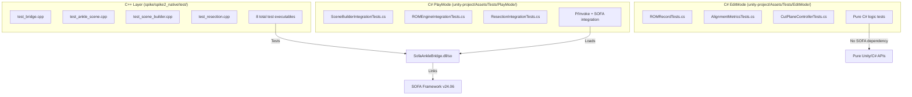

# Testing Guide

## Purpose

This guide explains how to write and run tests at every layer of the COUCH project. Tests exist at three layers: **C++ GTest** (native bridge logic), **C# EditMode** (pure Unity logic), and **C# PlayMode** (integration across the native boundary). Each layer tests different concerns and requires different setup.

After reading this guide, you will know:
- Which test layer to choose for a new test
- How to run tests at each layer (including WSL2/Windows considerations)
- The mandatory patterns for PlayMode tests (try/finally, DestroyScene, solverDiverged checks)
- Where test data (mesh geometry) comes from and why

---

## Test Architecture



### What Each Layer Tests

| Layer | Purpose | Dependencies | Runs Where | Typical Duration |
|-------|---------|--------------|------------|------------------|
| **C++ GTest** | Native bridge logic in isolation from Unity. Scene construction, ligament controller, async stepping, resection, triple buffer, ROM calculation. | SOFA Framework, GoogleTest (bundled with SOFA) | WSL2 or Windows command line via `ctest` | ~5 seconds (8 test executables, 60+ test cases) |
| **C# EditMode** | Pure C# logic that doesn't need SOFA. Data models (ROMRecord, AlignmentMetrics), validation, geometry math, cut plane controller. | Unity Test Framework (NUnit) | Unity Editor (Edit Mode Test Runner) | ~100ms (no native DLL loading) |
| **C# PlayMode** | C# ↔ C++ integration through the live native bridge. P/Invoke marshaling, scene lifecycle, ROM measurement, resection dual-representation. | Unity Test Framework, deployed native DLLs in `Assets/Plugins/x86_64/` | Unity Editor (Play Mode Test Runner) or Unity in batch mode | ~10-30 seconds (scene creation + physics stepping) |

---

## When to Use Each Test Type

### C++ GTest

**Use when:**
- Testing native bridge functions directly (`sofa_scene_create`, `sofa_add_rigid_bone`, etc.)
- Verifying SOFA scene graph structure (does the scene have the right components?)
- Testing ligament force calculations, joint angle extraction, resection algorithm
- Need to test faster than Unity PlayMode allows (no Unity initialization overhead)

**Examples:**
- `/home/coreyt/projects/couch/spike/spike2_native/test/test_scene_builder.cpp:128` — `CreateScene_WithDefaults_Succeeds`
- `/home/coreyt/projects/couch/spike/spike2_native/test/test_bridge.cpp:26` — `InitWithPluginDir`
- `/home/coreyt/projects/couch/spike/spike2_native/test/test_scene_builder.cpp:245` — `AddLigament_BetweenTwoBones_Succeeds`

**Do NOT use when:**
- Testing Unity-specific code (MonoBehaviour, Mesh API, Vector3 math)
- Testing P/Invoke marshaling correctness (that's PlayMode's job)

---

### C# EditMode

**Use when:**
- Testing pure C# logic (data models, math utilities, validation, geometry)
- No SOFA simulation needed (e.g., ROM data structure calculations, alignment metrics)
- Want fast iteration (EditMode tests run in ~100ms)

**Examples:**
- `/home/coreyt/projects/couch/unity-project/Assets/Tests/EditMode/DataModels/ROMRecordTests.cs:24` — `RecalculateTotalArc_SumsDFAndPF`
- `/home/coreyt/projects/couch/unity-project/Assets/Tests/EditMode/Resection/CutPlaneControllerTests.cs:11` — `CutPlane_DefaultTibial_Perpendicular90Degrees`

**Do NOT use when:**
- Need to call native bridge functions (DllImport doesn't work in EditMode — Unity doesn't load native plugins until PlayMode)
- Testing SOFA behavior

---

### C# PlayMode

**Use when:**
- Testing C# ↔ C++ integration across the P/Invoke boundary
- Verifying struct marshaling (do C# structs correctly map to C structs?)
- Testing end-to-end workflows (create scene via C#, step simulation, read snapshot)
- Testing ROM engine, resection engine, or any code that calls `SofaNativeBridge`

**Examples:**
- `/home/coreyt/projects/couch/unity-project/Assets/Tests/PlayMode/Bridge/SceneBuilderIntegrationTests.cs:78` — `CreateScene_WithDefaults_Succeeds`
- `/home/coreyt/projects/couch/unity-project/Assets/Tests/PlayMode/ROM/ROMEngineIntegrationTests.cs:52` — `StartSweep_AppliesExternalMoment`
- `/home/coreyt/projects/couch/unity-project/Assets/Tests/PlayMode/Resection/ResectionIntegrationTests.cs:106` — `ExecuteCut_SOFA_RemovesTetrahedra`

**Do NOT use when:**
- Testing pure C# logic (use EditMode instead — it's 100x faster)

---

## Running Tests

### C++ GTest

**Prerequisites:**
- SOFA Framework installed at `$SOFA_ROOT` (e.g., `/home/coreyt/sofa/SOFA_v24.06.00_Linux`)
- Native plugin built (see below)

**Build + Run (WSL2/Linux):**
```bash
cd /home/coreyt/projects/couch/spike/spike2_native
export SOFA_ROOT=~/sofa/SOFA_v24.06.00_Linux

# Configure
cmake --preset default

# Build
cmake --build build

# Run all tests
cd build && ctest

# Run one test executable (verbose output)
./test_scene_builder

# Run specific test case (GoogleTest filter)
./test_scene_builder --gtest_filter=SceneBuilderTest.AddLigament_BetweenTwoBones_Succeeds
```

**Expected output (success):**
```
Test project /home/coreyt/projects/couch/spike/spike2_native/build
      Start  1: BridgeTests
 1/8  Test  #1: BridgeTests ......................   Passed    0.52 sec
      Start  2: AnkleSceneTests
 2/8  Test  #2: AnkleSceneTests ..................   Passed    0.87 sec
      Start  3: AsyncTests
 3/8  Test  #3: AsyncTests .......................   Passed    0.61 sec
      Start  4: SceneBuilderTests
 4/8  Test  #4: SceneBuilderTests ................   Passed    1.23 sec
      Start  5: TripleBufferTests
 5/8  Test  #5: TripleBufferTests ................   Passed    0.04 sec
      Start  6: JointAngleTests
 6/8  Test  #6: JointAngleTests ..................   Passed    0.45 sec
      Start  7: ROMValidationTests
 7/8  Test  #7: ROMValidationTests ...............   Passed    2.10 sec
      Start  8: ResectionTests
 8/8  Test  #8: ResectionTests ...................   Passed    0.34 sec

100% tests passed, 0 tests failed out of 8
```

**Build + Run (Windows):**
```powershell
cd C:\projects\couch\spike\spike2_native
$env:SOFA_ROOT = "C:\sofa\SOFA_v24.06.00_Win64"

cmake --preset windows-release
cmake --build build-windows --config Release
cd build-windows
ctest -C Release
```

**Common failures:**
- **`SOFA_ROOT not set`** → Set `export SOFA_ROOT=/path/to/sofa` before running cmake
- **DLL not found (Windows)** → SOFA DLLs not on PATH. Add `%SOFA_ROOT%\bin` to PATH or copy DLLs to `build-windows\Release\`
- **Test hangs** → Solver diverged due to stiffness too high. Check test parameters. Kill with Ctrl+C and reduce stiffness values.

---

### C# EditMode

**Prerequisites:**
- Unity 6 installed
- Unity project opened in Editor

**Run (Unity Editor):**
1. Open Unity Editor with the project at `/home/coreyt/projects/couch/unity-project/`
2. Window → General → Test Runner
3. Select **EditMode** tab
4. Click **Run All** or right-click a specific test

**Run (Batch Mode from WSL2):**
```bash
cd /home/coreyt/projects/couch

# Convert Unity project path to Windows format
WIN_PROJECT=$(wslpath -w unity-project/)

# Run EditMode tests
"/mnt/c/Program Files/Unity/Hub/Editor/6000.3.8f1/Editor/Unity.exe" \
  -runTests \
  -batchmode \
  -projectPath "$WIN_PROJECT" \
  -testPlatform EditMode \
  -testResults "$(wslpath -w /tmp/editmode-results.xml)" \
  -logFile -

# Exit code 0 = all passed, non-zero = failures
echo "EditMode tests exit code: $?"
```

**Expected output (success):**
```
[TestRunnerCore] Running 23 tests in EditMode
[DataModels.ROMRecordTests] NewRecord_DefaultsAreZero PASSED (4 ms)
[DataModels.ROMRecordTests] RecalculateTotalArc_SumsDFAndPF PASSED (1 ms)
...
[Resection.CutPlaneControllerTests] VolumeCalculation_KnownCube_ReturnsCorrectVolume PASSED (8 ms)

23 tests passed, 0 failed, 0 skipped
Total time: 0.12s
```

**Common failures:**
- **Assembly reference missing** → Check `.asmdef` file has correct references. EditMode tests reference `AnkleSim.Core` only, NOT `AnkleSim.Bridge`.
- **Test not visible in Test Runner** → Check `defineConstraints` includes `UNITY_INCLUDE_TESTS` in `.asmdef`

---

### C# PlayMode

**Prerequisites:**
- Unity 6 installed
- **Native DLLs deployed to `Assets/Plugins/x86_64/`** (critical — see below)
- Unity project opened in Editor

**DLL Deployment (Required):**

PlayMode tests load the native bridge via P/Invoke. The DLLs MUST be in `Assets/Plugins/x86_64/` before running PlayMode tests.

```bash
# Linux: Copy .so and SOFA dependencies
cp spike/spike2_native/build/libSofaAnkleBridge.so unity-project/Assets/Plugins/x86_64/
spike/spike2_native/collect_sofa_deps.sh

# Windows: Copy .dll and SOFA dependencies
copy spike\spike2_native\build-windows\Release\SofaAnkleBridge.dll unity-project\Assets\Plugins\x86_64\
# Run collect_sofa_deps.ps1 or manually copy all DLLs from $SOFA_ROOT\bin
```

**Run (Unity Editor):**
1. Window → General → Test Runner
2. Select **PlayMode** tab
3. Click **Run All** (Unity enters Play Mode automatically)
4. Wait for tests to complete (10-30 seconds)

**Run (Batch Mode from WSL2):**

**WARNING:** Do NOT use `-runTests` with `-quit` — they race and tests may not run. Use `-runTests` WITHOUT `-quit`, then kill Unity process when done.

```bash
cd /home/coreyt/projects/couch

WIN_PROJECT=$(wslpath -w unity-project/)

# Run PlayMode tests (streams log to stdout, no -quit)
"/mnt/c/Program Files/Unity/Hub/Editor/6000.3.8f1/Editor/Unity.exe" \
  -runTests \
  -batchmode \
  -projectPath "$WIN_PROJECT" \
  -testPlatform PlayMode \
  -testResults "$(wslpath -w /tmp/playmode-results.xml)" \
  -logFile - &

# Store PID to kill later
UNITY_PID=$!

# Wait for tests to complete (poll results file)
while [ ! -f /tmp/playmode-results.xml ]; do sleep 1; done
sleep 5  # grace period for XML write

# Kill Unity process
kill $UNITY_PID

# Check results
if grep -q 'result="Passed"' /tmp/playmode-results.xml; then
    echo "PlayMode tests PASSED"
    exit 0
else
    echo "PlayMode tests FAILED"
    cat /tmp/playmode-results.xml
    exit 1
fi
```

**Expected output (success):**
```
[TestRunnerCore] Running 24 tests in PlayMode
[Bridge.SceneBuilderIntegrationTests] DllLoads_WithoutError PASSED (1015 ms)
[Bridge.SceneBuilderIntegrationTests] CreateScene_WithDefaults_Succeeds PASSED (523 ms)
[ROM.ROMEngineIntegrationTests] PreOpROM_WithConstraints_RecordsTotalArcNear25 PASSED (8234 ms)
...

24 tests passed, 0 failed, 0 skipped
Total time: 28.4s
```

**Common failures:**
- **DllNotFoundException: SofaAnkleBridge** → DLL not in `Assets/Plugins/x86_64/` OR SOFA dependency DLLs missing. Run `collect_sofa_deps.sh`.
- **EntryPointNotFoundException: sofa_bridge_init** → DLL version mismatch. Rebuild native plugin and redeploy.
- **Scene leak between tests** → Forgot `DestroyScene()` in `finally` block (see patterns below).
- **NullReferenceException on SofaSimulation** → Calling before `Initialize()` or after `Dispose()`.

---

## PlayMode Test Patterns

PlayMode tests call native code that manages global state (SOFA scene graph). Failure to clean up correctly corrupts subsequent tests. Follow these patterns exactly.

### Pattern 1: Initialize / try / finally { Dispose }

**Why:** `SofaSimulation` allocates native resources (SOFA root node, plugins). If a test throws an exception before `Dispose()`, subsequent tests crash due to double-init.

**Wrong — memory leak + crash on next test:**
```csharp
[UnityTest]
public IEnumerator MyTest()
{
    var sim = new SofaSimulation();
    sim.Initialize(pluginDir);
    sim.CreateAnkleScene(0.001f, -9810f);
    sim.Step(0.001f);  // If this throws, Dispose never runs
    sim.Dispose();     // NOT REACHED if exception above
    yield return null;
}
```

**Right — try/finally ensures cleanup:**
```csharp
[UnityTest]
public IEnumerator MyTest()
{
    var sim = new SofaSimulation();
    sim.Initialize(pluginDir);
    try
    {
        sim.CreateAnkleScene(0.001f, -9810f);
        sim.Step(0.001f);
        // Test assertions here
    }
    finally
    {
        sim.Dispose();  // ALWAYS runs, even if test fails
    }
    yield return null;
}
```

**Even better — use `using` statement:**
```csharp
[UnityTest]
public IEnumerator MyTest()
{
    using (var sim = new SofaSimulation())
    {
        sim.Initialize(pluginDir);
        sim.CreateAnkleScene(0.001f, -9810f);
        sim.Step(0.001f);
        // Dispose() called automatically at end of using block
    }
    yield return null;
}
```

**Reference:** `/home/coreyt/projects/couch/unity-project/Assets/Tests/PlayMode/Resection/ResectionIntegrationTests.cs:87` (uses `using` pattern)

---

### Pattern 2: DestroyScene in try/finally

**Why:** If a scene is created but not destroyed (e.g., test fails mid-execution), the next test that creates a scene will crash or produce corrupt data. `DestroyScene()` must be called even if test assertions fail.

**Wrong — scene leak:**
```csharp
[UnityTest]
public IEnumerator MyTest()
{
    _sim.CreateAnkleScene(0.001f, 0f);
    // ... test logic that might throw ...
    _sim.DestroyScene();  // NOT REACHED if assertion fails above
    yield return null;
}
```

**Right — try/finally guarantees cleanup:**
```csharp
[UnityTest]
public IEnumerator MyTest()
{
    _sim.CreateAnkleScene(0.001f, 0f);
    try
    {
        // ... test logic that might throw ...
        Assert.AreNotEqual(0f, engine.CurrentAngle);
    }
    finally
    {
        _sim.DestroyScene();  // ALWAYS runs
    }
    yield return null;
}
```

**Reference:** `/home/coreyt/projects/couch/unity-project/Assets/Tests/PlayMode/ROM/ROMEngineIntegrationTests.cs:57-74` (all ROM tests use this pattern)

---

### Pattern 3: Check solverDiverged in Assertions

**Why:** If the SOFA solver diverges (produces NaN), the simulation is corrupt but doesn't throw an exception. Subsequent assertions may pass with garbage data. Always check `snapshot.solverDiverged == 0` after stepping.

**Wrong — test passes with NaN data:**
```csharp
_sim.Step(0.001f);
var snap = new SofaFrameSnapshot();
SofaNativeBridge.sofa_get_frame_snapshot(ref snap);
Assert.IsFalse(double.IsNaN(snap.talus.pz));  // Might pass if NaN propagates as 0
```

**Right — explicit divergence check:**
```csharp
_sim.Step(0.001f);
var snap = new SofaFrameSnapshot();
SofaNativeBridge.sofa_get_frame_snapshot(ref snap);

Assert.AreEqual(0, snap.solverDiverged, "Solver diverged — reduce stiffness or timestep");
Assert.IsFalse(double.IsNaN(snap.talus.pz), "Talus Z should not be NaN");
```

**Note:** `solverDiverged` flag may lag by 1 frame due to triple-buffering (see [sofa-patterns.md](sofa-patterns.md#triple-buffer-lag)). If a test shows NaN but flag is 0, step once more and re-check.

**Reference:** `/home/coreyt/projects/couch/unity-project/Assets/Tests/PlayMode/Bridge/SceneBuilderIntegrationTests.cs:246` (checks `solverDiverged` after stepping)

---

### Pattern 4: pluginDir Must Point to Assets/Plugins/x86_64

**Why:** `sofa_bridge_init(pluginDir)` loads SOFA component plugins from the specified directory. If `pluginDir` is wrong, scene creation fails with cryptic errors like "Component 'EulerImplicitSolver' not found."

**Wrong — hardcoded Linux path:**
```csharp
_sim.Initialize("/home/coreyt/sofa/SOFA_v24.06.00_Linux/lib");
// Breaks on Windows, breaks when SOFA path changes
```

**Right — use Unity's Application.dataPath:**
```csharp
private static string PluginDir =>
    Path.Combine(Application.dataPath, "Plugins", "x86_64");

[SetUp]
public void SetUp()
{
    _sim = new SofaSimulation();
    _sim.Initialize(PluginDir);  // Works on Windows and Linux
}
```

**Reference:** `/home/coreyt/projects/couch/unity-project/Assets/Tests/PlayMode/Bridge/SceneBuilderIntegrationTests.cs:16-17` (canonical pattern)

---

### Pattern 5: SetUp / TearDown with DLL Availability Check

**Why:** PlayMode tests fail if native DLL is not deployed. Check DLL availability in `SetUp()` and skip tests gracefully with `Assert.Ignore()` instead of crashing.

**Pattern:**
```csharp
private bool _dllAvailable;

[SetUp]
public void SetUp()
{
    try
    {
        SofaNativeBridge.sofa_bridge_get_version();
        _dllAvailable = true;
    }
    catch (DllNotFoundException)
    {
        _dllAvailable = false;
    }

    if (!_dllAvailable)
        Assert.Ignore("SofaAnkleBridge DLL not available — skipping integration tests");
}

[TearDown]
public void TearDown()
{
    if (_dllAvailable)
    {
        try { SofaNativeBridge.sofa_bridge_shutdown(); }
        catch { /* best effort */ }
    }
}
```

**Reference:** `/home/coreyt/projects/couch/unity-project/Assets/Tests/PlayMode/Bridge/SceneBuilderIntegrationTests.cs:19-44` (canonical SetUp/TearDown)

---

## Adding a New Test

### Checklist: C++ GTest

1. **Create test file** in `spike/spike2_native/test/test_<feature>.cpp`
2. **Include GTest header** and `sofa_ankle_bridge.h`:
   ```cpp
   #include <gtest/gtest.h>
   #include "sofa_ankle_bridge.h"
   ```
3. **Define test fixture** (optional but recommended):
   ```cpp
   class MyFeatureTest : public ::testing::Test {
   protected:
       void SetUp() override {
           int rc = sofa_bridge_init(get_plugin_dir());
           ASSERT_EQ(rc, 0) << sofa_bridge_get_error();
       }
       void TearDown() override {
           sofa_bridge_shutdown();
       }
   };
   ```
4. **Write test cases** using `TEST_F(MyFeatureTest, TestName)`:
   ```cpp
   TEST_F(MyFeatureTest, MyTest) {
       auto cfg = default_scene_config();
       ASSERT_EQ(sofa_scene_create(&cfg), 0);
       // ... test logic ...
   }
   ```
5. **Add test executable to CMakeLists.txt** (see `/home/coreyt/projects/couch/spike/spike2_native/CMakeLists.txt:187-195` for pattern)
6. **Build and run**:
   ```bash
   cmake --build build
   cd build && ./test_my_feature
   ```

---

### Checklist: C# EditMode

1. **Create test file** in `unity-project/Assets/Tests/EditMode/<Category>/<Feature>Tests.cs`
2. **Add namespace**: `namespace AnkleSim.Tests.EditMode.<Category>`
3. **Add NUnit using**: `using NUnit.Framework;`
4. **Add assembly references** (e.g., `using AnkleSim.Core.DataModels;`)
5. **Write test class**:
   ```csharp
   public class MyFeatureTests
   {
       [Test]
       public void MyTest()
       {
           var obj = new MyClass();
           Assert.AreEqual(42, obj.Value);
       }
   }
   ```
6. **Run in Unity Test Runner** (Window → General → Test Runner → EditMode → Run All)

**Assembly reference rules:**
- EditMode tests can reference `AnkleSim.Core` (pure C# data models, math, geometry)
- EditMode tests CANNOT reference `AnkleSim.Bridge` (contains P/Invoke, only works in PlayMode)
- If you need to test bridge code, write a PlayMode test instead

---

### Checklist: C# PlayMode

1. **Deploy native DLL** to `Assets/Plugins/x86_64/` (see [Running Tests](#running-tests) section)
2. **Create test file** in `unity-project/Assets/Tests/PlayMode/<Category>/<Feature>IntegrationTests.cs`
3. **Add namespace**: `namespace AnkleSim.Tests.PlayMode.<Category>`
4. **Add usings**:
   ```csharp
   using System.Collections;
   using System.IO;
   using NUnit.Framework;
   using UnityEngine;
   using UnityEngine.TestTools;
   using AnkleSim.Bridge;
   ```
5. **Add SetUp/TearDown** with DLL check (copy pattern from `SceneBuilderIntegrationTests.cs:19-44`)
6. **Write test as IEnumerator coroutine**:
   ```csharp
   [UnityTest]
   public IEnumerator MyTest()
   {
       var sim = new SofaSimulation();
       sim.Initialize(PluginDir);
       try
       {
           sim.CreateAnkleScene(0.001f, -9810f);
           sim.Step(0.001f);
           Assert.IsTrue(sim.IsSceneReady());
       }
       finally
       {
           sim.Dispose();
       }
       yield return null;
   }
   ```
7. **Run in Unity Test Runner** (PlayMode tab) or batch mode
8. **Check for scene leaks:** If subsequent tests fail with "Already initialized" or crash, add `DestroyScene()` in `finally` block

**When to use `yield return null`:**
- **Always** at the end of the test (required by UnityTest coroutine contract)
- **Rarely** in the middle of a test (only if you need Unity to process a frame, e.g., waiting for async loading — not needed for SOFA stepping)

---

## Test Data

### Mesh Data Sources

Tests need mesh geometry (vertices + triangles or tetrahedra) to construct SOFA scenes. There are two strategies:

#### 1. Inline Minimal Meshes (Preferred for Unit Tests)

**Use when:** Testing scene construction logic, not anatomical accuracy. Want tests to run fast and be self-contained.

**Example (C++):**
```cpp
// Box mesh: 8 vertices, 12 triangles
static const float TIBIA_BOX_VERTS[] = {
    -20, -15, -15,  20, -15, -15,  20,  15, -15,  -20,  15, -15,
    -20, -15,  15,  20, -15,  15,  20,  15,  15,  -20,  15,  15,
};
static const int TIBIA_BOX_TRIS[] = {
    0,1,2, 0,2,3, 4,6,5, 4,7,6,
    0,4,5, 0,5,1, 2,6,7, 2,7,3,
    0,3,7, 0,7,4, 1,5,6, 1,6,2,
};
```

**Reference:** `/home/coreyt/projects/couch/spike/spike2_native/test/test_scene_builder.cpp:38-56` (box meshes for tibia and talus)

**Example (C#):**
```csharp
// Unit cube for resection tests
private static readonly float[] CubeVerts = {
    0, 0, 0,  1, 0, 0,  1, 1, 0,  0, 1, 0,
    0, 0, 1,  1, 0, 1,  1, 1, 1,  0, 1, 1,
};
private static readonly int[] CubeTetras = {
    0, 1, 3, 4,
    1, 2, 3, 6,
    1, 3, 4, 6,
    4, 6, 3, 7,
    1, 4, 5, 6,
};
```

**Reference:** `/home/coreyt/projects/couch/unity-project/Assets/Tests/PlayMode/Resection/ResectionIntegrationTests.cs:19-29`

**Why inline meshes:**
- Self-documenting (geometry is visible in test code)
- No file I/O (faster test execution)
- No external dependencies (test doesn't break if STL file is moved)
- Easy to construct degenerate cases (e.g., single tetrahedron for edge case testing)

---

#### 2. Loaded STL Meshes (Reserved for Validation Tests)

**Use when:** Testing ROM against clinical data, verifying anatomical accuracy, biomechanical validation.

**NOT YET IMPLEMENTED** — Current tests use inline meshes only. When clinical validation is needed, add:
- STL mesh files in `unity-project/Assets/StreamingAssets/Meshes/`
- Mesh loading utility in `AnkleSim.Core.Loaders.MeshLoader`
- Validation tests in `Assets/Tests/PlayMode/Validation/`

**Why NOT loaded meshes for most tests:**
- Slower (file I/O + mesh parsing)
- Harder to debug (can't see geometry at a glance)
- Test failure doesn't clearly indicate which geometric feature caused the problem

**Example (FUTURE):**
```csharp
[UnityTest]
public IEnumerator ClinicalROM_WithAnatomicalMesh_MatchesGlazebrook2008()
{
    var tibiaMesh = MeshLoader.LoadSTL("StreamingAssets/Meshes/tibia_bodyparts3d.stl");
    var talusMesh = MeshLoader.LoadSTL("StreamingAssets/Meshes/talus_bodyparts3d.stl");
    // ... build scene with anatomical meshes ...
    // ... measure ROM ...
    Assert.InRange(totalArc, 22f, 31f);  // Clinical range from Glazebrook 2008
}
```

---

## Test Organization (Assembly Definitions)

### Assembly Structure

```
unity-project/Assets/
├── AnkleSim/
│   ├── Core/              → AnkleSim.Core.asmdef (pure C# models)
│   ├── Bridge/            → AnkleSim.Bridge.asmdef (P/Invoke)
│   └── Runtime/           → AnkleSim.Runtime.asmdef (MonoBehaviours)
└── Tests/
    ├── EditMode/          → AnkleSim.Tests.EditMode.asmdef
    │   ├── DataModels/
    │   ├── Validation/
    │   └── Math/
    └── PlayMode/          → AnkleSim.Tests.PlayMode.asmdef
        ├── Bridge/
        ├── ROM/
        └── Resection/
```

### EditMode Assembly Definition

**File:** `/home/coreyt/projects/couch/unity-project/Assets/Tests/EditMode/AnkleSim.Tests.EditMode.asmdef`

**Key fields:**
```json
{
  "name": "AnkleSim.Tests.EditMode",
  "references": [
    "AnkleSim.Core"  // Can reference Core only (no Bridge, no Runtime)
  ],
  "includePlatforms": ["Editor"],  // EditMode runs in Editor only
  "defineConstraints": ["UNITY_INCLUDE_TESTS"]
}
```

**Why `includePlatforms: ["Editor"]`?** EditMode tests must NOT be included in builds. They only run in Unity Editor.

---

### PlayMode Assembly Definition

**File:** `/home/coreyt/projects/couch/unity-project/Assets/Tests/PlayMode/AnkleSim.Tests.PlayMode.asmdef`

**Key fields:**
```json
{
  "name": "AnkleSim.Tests.PlayMode",
  "references": [
    "AnkleSim.Core",
    "AnkleSim.Runtime",
    "AnkleSim.Bridge"  // Can reference Bridge (P/Invoke works in PlayMode)
  ],
  "includePlatforms": [],  // Empty = all platforms
  "defineConstraints": ["UNITY_INCLUDE_TESTS"]
}
```

**Why `includePlatforms: []`?** PlayMode tests can run in Editor or in builds (e.g., CI server running Unity in batch mode).

---

### Common Assembly Definition Mistakes

| Mistake | Symptom | Fix |
|---------|---------|-----|
| EditMode test references `AnkleSim.Bridge` | `DllNotFoundException` or "type not found" | Remove `AnkleSim.Bridge` from references. Move test to PlayMode if it needs P/Invoke. |
| PlayMode test missing `AnkleSim.Bridge` reference | `SofaNativeBridge` type not found | Add `"AnkleSim.Bridge"` to references array in `.asmdef` |
| Forgot `UNITY_INCLUDE_TESTS` define constraint | Tests not visible in Test Runner | Add `"defineConstraints": ["UNITY_INCLUDE_TESTS"]` |
| Test in wrong directory (EditMode code in PlayMode folder) | Test runs but is slow / loads DLLs unnecessarily | Move test to correct folder and update namespace |

---

## Cross-References

- **[native-boundary.md](native-boundary.md)** — Memory ownership rules for P/Invoke structs (IntPtr lifecycle, FreeNativePtrs)
- **[sofa-patterns.md](sofa-patterns.md)** — SOFA scene state machine (Empty → Created → Finalized), solver divergence detection, ligament stability
- **[onboarding.md](onboarding.md)** — DLL deployment workflow, SOFA_ROOT setup, cross-platform build instructions

---

## Troubleshooting

### "DllNotFoundException: SofaAnkleBridge" (PlayMode)

**Cause:** Native DLL not in `Assets/Plugins/x86_64/` OR missing SOFA dependency DLLs.

**Fix:**
1. Verify `SofaAnkleBridge.dll` (Windows) or `libSofaAnkleBridge.so` (Linux) exists in `Assets/Plugins/x86_64/`
2. Run `collect_sofa_deps.sh` (Linux) or `collect_sofa_deps.ps1` (Windows) to copy SOFA dependencies
3. Check Unity Console for specific missing DLL name (e.g., "Sofa.Core.dll not found")
4. If running in batch mode, ensure `Library/` folder is excluded from WSL scans (it's huge and causes timeouts)

---

### "Scene leak between tests" / "Already initialized"

**Cause:** Test created a scene but didn't call `DestroyScene()` before exiting (usually due to exception).

**Fix:**
1. Wrap scene creation in `try/finally`:
   ```csharp
   _sim.CreateAnkleScene(0.001f, 0f);
   try
   {
       // ... test logic ...
   }
   finally
   {
       _sim.DestroyScene();
   }
   ```
2. If using `SofaSimulation` directly, wrap in `using` statement or call `Dispose()` in `finally`

---

### "Solver diverged" / NaN in snapshot

**Cause:** Ligament stiffness too high, timestep too large, or deformable tissue Young's modulus too high.

**Fix:**
1. Check `snapshot.solverDiverged == 0` after every `Step()` call
2. Reduce ligament stiffness to < 3x default (see [sofa-patterns.md](sofa-patterns.md#ligament-stability))
3. Reduce timestep (try 0.0005 instead of 0.001)
4. Increase Rayleigh damping (try `rayleigh_stiffness = 0.2`)

**Reference:** `/home/coreyt/projects/couch/docs/dev/sofa-patterns.md` (ligament stability envelope)

---

### C++ test compiles but segfaults on run

**Cause:** SOFA plugins not loaded (invalid `pluginDir`) OR SOFA version mismatch (compiled against different version than runtime).

**Fix:**
1. Verify `SOFA_PLUGIN_DIR` and `SOFA_ROOT` environment variables are set in `ctest` environment (see `CMakeLists.txt:200`)
2. Check SOFA version: `$SOFA_ROOT/bin/runSofa --version` should be v24.06.00
3. Rebuild native plugin: `cmake --build build --target clean && cmake --build build`

---

### Unity batch mode tests hang indefinitely

**Cause:** Using `-runTests` with `-quit` — Unity exits before tests finish writing results.

**Fix:**
1. Remove `-quit` from command
2. Run Unity in background with `&`, capture PID
3. Poll for results file creation (`/tmp/playmode-results.xml`)
4. Kill Unity process after results written (see [Running Tests](#running-tests) section for full script)

---

## Summary

- **C++ GTest** → Fast, tests native bridge in isolation. Use for SOFA scene logic, ligament physics, resection algorithm.
- **C# EditMode** → Fastest, tests pure C# code. Use for data models, math, validation logic.
- **C# PlayMode** → Slow, tests P/Invoke integration. Use for end-to-end workflows, struct marshaling, ROM/resection engines.
- **Always use try/finally** for `SofaSimulation.Dispose()` and `DestroyScene()` in PlayMode tests.
- **Always check `solverDiverged`** after stepping the simulation.
- **Use inline minimal meshes** for unit tests. Reserve STL loading for clinical validation.
- **Deploy native DLLs** to `Assets/Plugins/x86_64/` before running PlayMode tests.

When in doubt, copy the patterns from `SceneBuilderIntegrationTests.cs` (PlayMode), `ROMRecordTests.cs` (EditMode), or `test_scene_builder.cpp` (C++).
